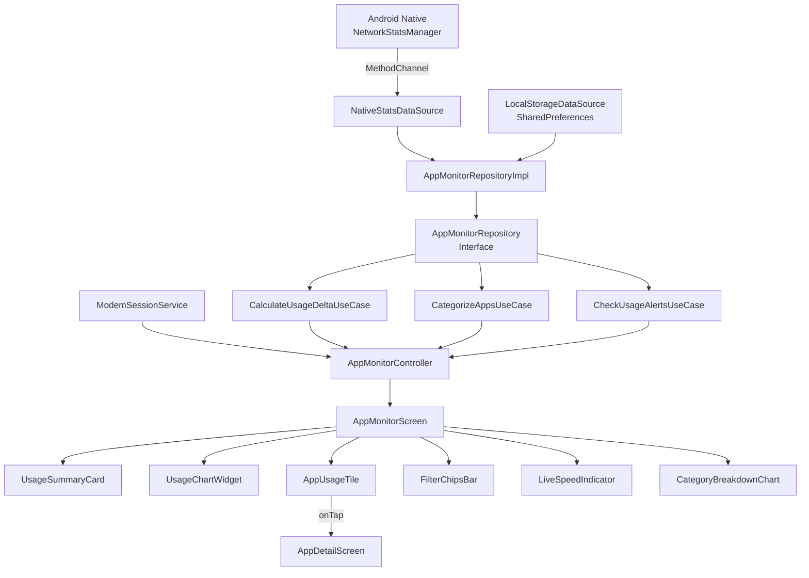

# 🏗️ إعادة الهيكلة المعمارية — Clean Architecture V2

## الهيكل الجديد المقترح

```
mifi_app_monitor/
├── domain/
│   ├── entities/
│   │   ├── app_usage_entity.dart         ← [تعديل] إضافة: category, isSystemApp, lastActiveTime
│   │   ├── app_usage_snapshot.dart        ← [جديد] لقطة مؤرخة = الكيان الأساسي للتخزين
│   │   ├── app_category.dart             ← [جديد] تصنيفات التطبيقات enum + mapper
│   │   └── usage_alert.dart              ← [جديد] كيان التنبيهات الذكية
│   ├── repositories/
│   │   └── app_monitor_repository.dart   ← [تعديل] توسيع الواجهة
│   ├── use_cases/
│   │   ├── calculate_usage_delta_usecase.dart  ← [تعديل] تحسين الدقة
│   │   ├── get_app_detail_usecase.dart         ← [جديد] جلب تفاصيل تطبيق واحد
│   │   ├── categorize_apps_usecase.dart        ← [جديد] تصنيف التطبيقات تلقائياً
│   │   └── check_usage_alerts_usecase.dart     ← [جديد] فحص التنبيهات
│   └── services/
│       └── modem_session_service.dart          ← [جديد] خدمة ربط جلسة المودم (يفك الاقتران)
├── infrastructure/
│   ├── data_sources/
│   │   ├── native_stats_data_source.dart       ← [تعديل] تحسين + validation
│   │   └── local_storage_data_source.dart      ← [جديد] فصل التخزين المحلي
│   ├── repositories/
│   │   └── app_monitor_repository_impl.dart    ← [تعديل] إعادة هيكلة
│   └── mappers/
│       └── app_category_mapper.dart            ← [جديد] خريطة تصنيف التطبيقات
└── presentation/
    ├── controllers/
    │   └── app_monitor_controller.dart         ← [تعديل جذري] تبسيط + تقسيم المسؤوليات
    ├── pages/
    │   ├── app_monitor_screen.dart             ← [تعديل جذري] الشاشة الرئيسية
    │   └── app_detail_screen.dart              ← [جديد] شاشة تفاصيل التطبيق
    └── widgets/
        ├── usage_summary_card.dart             ← [جديد] كارت الإحصائيات المركزي
        ├── live_speed_indicator.dart           ← [جديد] مؤشر السرعة اللحظية
        ├── usage_chart_widget.dart             ← [جديد] الرسم البياني التفاعلي
        ├── app_usage_tile.dart                 ← [جديد] بطاقة التطبيق في القائمة
        ├── filter_chips_bar.dart               ← [جديد] شريط الفلاتر
        ├── category_breakdown_chart.dart       ← [جديد] دائرة التصنيفات
        ├── connection_status_banner.dart       ← [جديد] شريط حالة الاتصال
        ├── search_bar_widget.dart              ← [جديد] شريط البحث
        └── permission_gate_widget.dart         ← [جديد] شاشة طلب الصلاحية
```

---

## 🔧 التغييرات المعمارية الأساسية

### 1. إصلاح حقن التبعيات (Critical Fix)

**الحالي (مكسور):**
```dart
// في network_info_page.dart - يدوي ومتكرر
void _navigateToAppMonitor() {
  if (Get.isRegistered<AppMonitorController>()) {
    Get.delete<AppMonitorController>();
  }
  final nativeDataSource = NativeStatsDataSource();
  // ...
  Get.put(AppMonitorController(repository, useCase));
}
```

**المقترح (نظيف):**
```dart
// في injection_container.dart - مركزي ومستمر
// ==========================================
// --- ميزة مراقب التطبيقات (App Monitor) ---
// ==========================================
Get.lazyPut(() => NativeStatsDataSource(), fenix: true);
Get.lazyPut(() => LocalStorageDataSource(), fenix: true);
Get.lazyPut<AppMonitorRepository>(
  () => AppMonitorRepositoryImpl(
    nativeDataSource: Get.find(),
    localStorage: Get.find(),
  ),
  fenix: true,
);
Get.lazyPut(() => CalculateUsageDeltaUseCase(), fenix: true);
Get.lazyPut(() => CategorizeAppsUseCase(), fenix: true);
Get.lazyPut(() => CheckUsageAlertsUseCase(Get.find()), fenix: true);
Get.lazyPut(() => ModemSessionService(), fenix: true);
Get.lazyPut(() => AppMonitorController(
  repository: Get.find(),
  deltaUseCase: Get.find(),
  categorizeUseCase: Get.find(),
  alertsUseCase: Get.find(),
  sessionService: Get.find(),
), fenix: true);
```

```dart
// في network_info_page.dart - أصبح خط واحد فقط!
void _navigateToAppMonitor() {
  Get.to(() => AppMonitorScreen(), transition: Transition.cupertino);
}
```

### 2. فك الاقتران مع DashboardController

**الحالي (اقتران وثيق):**
```dart
try {
  final dash = Get.find<DashboardController>();
  final currentUptime = dash.dashboardData.value?.currentDuration ?? 0;
} catch (_) {}  // يخفي الأخطاء!
```

**المقترح (خدمة مستقلة):**
```dart
// domain/services/modem_session_service.dart
class ModemSessionService {
  /// يجلب Uptime الحالي بطريقة آمنة
  /// يحاول أولاً من DashboardController (إن كان متاحاً)
  /// وإلا يجلب مباشرةً من API المودم
  int getCurrentModemUptime() {
    try {
      if (Get.isRegistered<DashboardController>()) {
        return Get.find<DashboardController>()
          .dashboardData.value?.currentDuration ?? 0;
      }
    } catch (_) {}
    return 0; // fallback
  }

  bool hasModemRestarted(int currentUptime, int lastUptime) {
    return lastUptime > 0 && currentUptime < lastUptime;
  }
}
```

### 3. فصل التخزين المحلي

**الحالي (مدمج في Repository):**
```dart
class AppMonitorRepositoryImpl {
  // كل التخزين يُنفذ هنا مباشرة
  Future<void> _saveSnapshot(String key, ...) async {
    final prefs = await SharedPreferences.getInstance();
    // ...
  }
}
```

**المقترح (DataSource منفصل):**
```dart
// infrastructure/data_sources/local_storage_data_source.dart
class LocalStorageDataSource {
  SharedPreferences? _prefs;
  
  Future<SharedPreferences> get prefs async {
    _prefs ??= await SharedPreferences.getInstance();
    return _prefs!;
  }

  // Centralized storage operations with proper keys
  Future<void> saveSnapshot(String key, Map<String, List<int>> data) async { ... }
  Future<Map<String, List<int>>> getSnapshot(String key) async { ... }
  
  // تنظيف البيانات القديمة (> 30 يوم)
  Future<void> cleanOldData({int retentionDays = 30}) async { ... }
}
```

### 4. تبسيط المتحكم (Controller Simplification)

**الحالي:** 357 سطر — يفعل كل شيء: جلب البيانات، الحسابات، التخزين، كشف الشبكة، التنسيق

**المقترح:** تقسيم المسؤوليات:

```dart
class AppMonitorController extends GetxController {
  // Dependencies (كل واحد له دور واحد)
  final AppMonitorRepository _repository;
  final CalculateUsageDeltaUseCase _deltaUseCase;
  final CategorizeAppsUseCase _categorizeUseCase;
  final CheckUsageAlertsUseCase _alertsUseCase;
  final ModemSessionService _sessionService;

  // State (مركزي ونظيف)
  var state = MonitorState.initial().obs;
  var filter = MonitorFilter.today.obs;
  var searchQuery = ''.obs;

  // Methods (واضحة ومحدودة)
  Future<void> refreshUsage() async { ... }   // ~30 سطر بدل 100+
  void changeFilter(MonitorFilter f) { ... }
  void updateSearch(String q) { ... }
}
```

---

## 📊 مخطط التدفق المعماري



---

## 🔑 تحسينات الكيانات

### AppUsageEntity المُحسّن
```dart
class AppUsageEntity {
  final String packageName;
  final String appName;
  final int totalBytes;
  final int rxBytes;
  final int txBytes;
  final int rxSpeed;         // Bytes/s
  final int txSpeed;         // Bytes/s
  final Uint8List? iconData;
  final AppCategory category;      // ← جديد
  final bool isSystemApp;          // ← جديد
  final DateTime? lastActiveTime;  // ← جديد
  
  // Helper getters
  double get percentage => /* من إجمالي الاستهلاك */;
  bool get isCurrentlyActive => rxSpeed > 0 || txSpeed > 0;
  int get totalSpeed => rxSpeed + txSpeed;
}
```

### AppCategory (جديد)
```dart
enum AppCategory {
  socialMedia,    // واتساب، تيليجرام، فيسبوك...
  streaming,      // يوتيوب، نتفليكس...
  gaming,         // ألعاب
  browsing,       // متصفحات
  productivity,   // بريد، مستندات
  system,         // خدمات النظام
  other,          // غير مصنف
}
```

### UsageAlert (جديد)
```dart
class UsageAlert {
  final String appName;
  final String packageName;
  final int bytesConsumed;
  final AlertLevel level;        // info, warning, critical
  final String message;
  final DateTime triggeredAt;
}

enum AlertLevel { info, warning, critical }
```

---

## 📝 ملخص التغييرات

| الملف | الحالة | التغيير |
|-------|--------|---------|
| `injection_container.dart` | تعديل | إضافة تسجيل كامل لجميع مكونات App Monitor |
| `network_info_page.dart` | تعديل | إزالة الحقن اليدوي، تبسيط التنقل |
| `app_usage_entity.dart` | تعديل | إضافة category, isSystemApp, lastActiveTime |
| `app_usage_history.dart` | حذف | كيان غير مستخدم |
| `app_monitor_repository.dart` | تعديل | توسيع الواجهة |
| `calculate_usage_delta_usecase.dart` | تعديل | تحسين دقة السرعة |
| `app_usage_snapshot.dart` | جديد | كيان اللقطة المؤرخة |
| `app_category.dart` | جديد | تعريف التصنيفات |
| `usage_alert.dart` | جديد | كيان التنبيهات |
| `modem_session_service.dart` | جديد | خدمة جلسة المودم |
| `local_storage_data_source.dart` | جديد | فصل التخزين المحلي |
| `app_category_mapper.dart` | جديد | خريطة تصنيف حسب packageName |
| `get_app_detail_usecase.dart` | جديد | تفاصيل تطبيق واحد |
| `categorize_apps_usecase.dart` | جديد | تصنيف تلقائي |
| `check_usage_alerts_usecase.dart` | جديد | فحص التنبيهات |
| `app_monitor_controller.dart` | تعديل جذري | تبسيط وتقسيم |
| `app_monitor_screen.dart` | تعديل جذري | تقسيم إلى Widgets |
| `app_detail_screen.dart` | جديد | شاشة تفاصيل التطبيق |
| 8 Widget files | جديد | مكونات واجهة مفصولة |
