# 🚀 مراحل التنفيذ والأولويات — Implementation Phases

## الفلسفة: تحسين تدريجي بدون كسر

> كل مرحلة تُنتج نسخة **عاملة ومحسّنة** من المراقب.
> لا يتم الانتقال للمرحلة التالية إلا بعد اختبار السابقة.

---

## المرحلة 0: الأساسيات الحرجة (Critical Fixes) 🔴
**المدة المقدرة**: 1-2 ساعات  
**الهدف**: إصلاح المشاكل الجوهرية التي تؤثر على الاستقرار والبنية

### المهام:

#### 0.1 • إصلاح حقن التبعيات (DI Fix)
- [ ] إضافة تسجيل App Monitor في `injection_container.dart`
- [ ] إزالة الحقن اليدوي من `network_info_page.dart`
- [ ] استخدام `Get.find()` بدلاً من `Get.put()` في التنقل

```dart
// إضافة لـ injection_container.dart:
Get.lazyPut(() => NativeStatsDataSource(), fenix: true);
Get.lazyPut<AppMonitorRepository>(
  () => AppMonitorRepositoryImpl(nativeDataSource: Get.find()),
  fenix: true,
);
Get.lazyPut(() => CalculateUsageDeltaUseCase(), fenix: true);
Get.lazyPut(() => AppMonitorController(Get.find(), Get.find()), fenix: true);
```

#### 0.2 • إصلاح المؤشر الدائري الثابت
- [ ] استبدال `value: 0.7` بقيمة ديناميكية
- [ ] حساب النسبة: `rxBytes / (rxBytes + txBytes)` أو نسبة من الباقة

#### 0.3 • إصلاح Catch الصامت
- [ ] إضافة `debugPrint` لكل `catch`
- [ ] إضافة تعامل آمن مع `DashboardController`

#### 0.4 • إصلاح انتهاك الثيم
- [ ] تشغيل `python replace_theme.py`
- [ ] التأكد من استخدام `Theme.of(context)` 
- [ ] إصلاح لون المود الفاتح (`Colors.grey[600]` → لون مناسب)

#### 0.5 • حذف الكود الميت
- [ ] حذف `app_usage_history.dart` (غير مستخدم)

**ملفات متأثرة**: 
`injection_container.dart`, `network_info_page.dart`, `app_monitor_screen.dart`, `app_monitor_controller.dart`

---

## المرحلة 1: إعادة هيكلة البنية (Architecture Refactor) 🟠
**المدة المقدرة**: 3-4 ساعات  
**الهدف**: تنظيف البنية وفصل المسؤوليات بدون تغيير الوظائف

### المهام:

#### 1.1 • إنشاء LocalStorageDataSource
- [ ] نقل كل عمليات SharedPreferences من Repository
- [ ] استخدام separator آمن (`|` بدلاً من `:::`)
- [ ] إضافة `cleanOldData()` مع retention policy

#### 1.2 • إنشاء ModemSessionService
- [ ] نقل منطق كشف إعادة تشغيل المودم
- [ ] فك الاقتران مع DashboardController
- [ ] Fallback آمن عند عدم توفر Dashboard

#### 1.3 • تبسيط AppMonitorController
- [ ] تقسيم `refreshUsage()` إلى methods أصغر
- [ ] نقل `formatBytes()` و `formatSpeed()` إلى utility مشترك
- [ ] تحسين إدارة الحالة (MonitorState object)

#### 1.4 • تحسين AppUsageEntity
- [ ] إضافة `category` field
- [ ] إضافة `isSystemApp` field
- [ ] إضافة helper getters

#### 1.5 • تحسين NativeStatsDataSource
- [ ] إضافة icon cache
- [ ] إضافة data validation
- [ ] null-safety كاملة

**ملفات جديدة**: 
`local_storage_data_source.dart`, `modem_session_service.dart`

**ملفات متأثرة**: 
`app_monitor_repository_impl.dart`, `app_monitor_controller.dart`, `app_usage_entity.dart`, `native_stats_data_source.dart`

---

## المرحلة 2: تقسيم الواجهة (Widget Decomposition) 🟡
**المدة المقدرة**: 4-5 ساعات  
**الهدف**: تفكيك الشاشة المونوليثية إلى Widgets مستقلة قابلة لإعادة الاستخدام

### المهام:

#### 2.1 • إنشاء مكونات الواجهة
- [ ] `UsageSummaryCard` — كارت الإحصائيات مع مؤشر دائري ديناميكي
- [ ] `FilterChipsBar` — شريط الفلاتر الزمنية
- [ ] `ConnectionStatusBanner` — شريط حالة الاتصال
- [ ] `AppUsageTile` — بطاقة التطبيق
- [ ] `PermissionGateWidget` — شاشة طلب الصلاحية

#### 2.2 • إعادة بناء الشاشة الرئيسية
- [ ] استخدام الـ Widgets المنفصلة بدلاً من الدوال المضمنة
- [ ] إضافة Header جديد بتصميم gradient
- [ ] تحسين الـ layout لدعم RTL بشكل أفضل

#### 2.3 • إضافة شريط البحث المرئي
- [ ] `SearchBarWidget` مع تصميم زجاجي
- [ ] ربطه بـ `controller.updateSearch()`

**ملفات جديدة**: 
`widgets/usage_summary_card.dart`, `widgets/filter_chips_bar.dart`, `widgets/connection_status_banner.dart`, `widgets/app_usage_tile.dart`, `widgets/permission_gate_widget.dart`, `widgets/search_bar_widget.dart`

**ملفات متأثرة**: 
`app_monitor_screen.dart`

---

## المرحلة 3: التحسينات البصرية (Visual Enhancement) 🟢
**المدة المقدرة**: 3-4 ساعات  
**الهدف**: رفع مستوى الواجهة لتتناسق مع باقي شاشات Linkary

### المهام:

#### 3.1 • مؤشر السرعة اللحظية
- [ ] `LiveSpeedIndicator` مع نبض عند النشاط
- [ ] عرض في الترويسة وفي بطاقات التطبيقات النشطة

#### 3.2 • تحسين الرسم البياني
- [ ] إضافة Tooltip تفاعلي عند اللمس
- [ ] تأثير gradient على الأعمدة
- [ ] Legend واضح (تحميل / رفع)
- [ ] دعم AreaChart كبديل

#### 3.3 • تأثيرات حركية
- [ ] Staggered entry animation للقائمة
- [ ] Pulse effect عند تحديث الأرقام
- [ ] Shimmer loading state

#### 3.4 • تحسين بطاقة التطبيق
- [ ] شارة "نشط الآن" (نقطة خضراء)
- [ ] نسبة مئوية بجانب الحجم
- [ ] شريط تقدم مزدوج محسّن

**ملفات جديدة**: 
`widgets/live_speed_indicator.dart`, `widgets/usage_chart_widget.dart`

**ملفات متأثرة**: 
`app_monitor_screen.dart`, `widgets/app_usage_tile.dart`

---

## المرحلة 4: الميزات الذكية (Smart Features) 🔵
**المدة المقدرة**: 4-5 ساعات  
**الهدف**: إضافة الذكاء والقيمة المضافة

### المهام:

#### 4.1 • نظام التصنيف
- [ ] إنشاء `AppCategoryMapper`
- [ ] إنشاء `CategorizeAppsUseCase`
- [ ] إضافة `CategoryBreakdownChart` (Donut Chart)
- [ ] شارات التصنيف على بطاقات التطبيقات

#### 4.2 • نظام التنبيهات
- [ ] إنشاء `UsageAlert` entity
- [ ] إنشاء `CheckUsageAlertsUseCase`
- [ ] ربط مع Snackbar notifications
- [ ] تجنب تكرار التنبيه نفسه

#### 4.3 • شاشة تفاصيل التطبيق
- [ ] إنشاء `AppDetailScreen`
- [ ] Hero Animation للأيقونة
- [ ] رسم بياني لاستهلاك آخر 7 أيام
- [ ] معلومات تفصيلية (تصنيف، نظام، نسبة...)

#### 4.4 • إعادة تعيين الجلسة
- [ ] زر "إعادة تعيين" في الترويسة أو القائمة
- [ ] Dialog تأكيد
- [ ] حفظ زمن آخر إعادة تعيين

**ملفات جديدة**: 
`entities/app_category.dart`, `entities/usage_alert.dart`, `use_cases/categorize_apps_usecase.dart`, `use_cases/check_usage_alerts_usecase.dart`, `mappers/app_category_mapper.dart`, `pages/app_detail_screen.dart`, `widgets/category_breakdown_chart.dart`

---

## المرحلة 5: تحسين الأداء (Performance) 🟣
**المدة المقدرة**: 2-3 ساعات  
**الهدف**: تحسين أداء التطبيق وتقليل استهلاك الموارد

### المهام:

#### 5.1 • تحسين Android Native
- [ ] إضافة icon cache في Kotlin
- [ ] إضافة استعلام بنطاق زمني (`getAppUsageSince`)
- [ ] إضافة `isSystemApp` flag

#### 5.2 • تحسين Dart Side
- [ ] Cache أيقونات في NativeStatsDataSource
- [ ] SharedPreferences singleton (بدل getInstance كل مرة)
- [ ] تقليل rebuilds غير ضرورية (Obx الدقيق)

#### 5.3 • تنظيف البيانات
- [ ] تشغيل `cleanOldData()` عند بدء التطبيق
- [ ] retention policy: 60 يوم

---

## ملخص المراحل

```mermaid
gantt
    title مراحل تطوير مراقب التطبيقات
    dateFormat  HH
    axisFormat %H ساعة
    
    section المرحلة 0 🔴
    إسلاح DI + Bugs           :crit, m0, 00, 2h
    
    section المرحلة 1 🟠
    إعادة هيكلة البنية         :m1, after m0, 4h
    
    section المرحلة 2 🟡
    تقسيم الواجهة              :m2, after m1, 5h
    
    section المرحلة 3 🟢
    التحسينات البصرية          :m3, after m2, 4h
    
    section المرحلة 4 🔵
    الميزات الذكية              :m4, after m3, 5h
    
    section المرحلة 5 🟣
    تحسين الأداء                :m5, after m4, 3h
```



---

## 📊 جدول ملخص

| المرحلة | اسمها | الجهد | الملفات الجديدة | الأولوية |
|---------|-------|-------|----------------|----------|
| 0 | إصلاحات حرجة | 2 ساعات | 0 | 🔴 فوري |
| 1 | هيكلة البنية | 4 ساعات | 2 | 🔴 فوري |
| 2 | تقسيم الواجهة | 5 ساعات | 6 | 🟠 مهم |
| 3 | تحسينات بصرية | 4 ساعات | 2 | 🟠 مهم |
| 4 | ميزات ذكية | 5 ساعات | 7+ | 🟡 تحسين |
| 5 | أداء | 3 ساعات | 0 | 🟡 تحسين |
| **المجموع** | | **~23 ساعة** | **17+ ملف** | |

---

## ✅ معايير القبول لكل مرحلة

### المرحلة 0:
- [ ] `flutter analyze` بدون أخطاء
- [ ] المراقب لا يفقد بيانات الجلسة عند إغلاق وفتح الشاشة
- [ ] المؤشر الدائري يعرض القيمة الحقيقية
- [ ] لا يوجد `Get.isDarkMode` في ملفات المراقب

### المرحلة 1:
- [ ] كل class يتبع مبدأ المسؤولية الواحدة (SRP)
- [ ] لا اقتران مباشر مع DashboardController
- [ ] البيانات القديمة تُنظف تلقائياً

### المرحلة 2:
- [ ] كل Widget في ملف منفصل
- [ ] شريط البحث يعمل ويعرض نتائج فورية
- [ ] الشاشة الرئيسية < 100 سطر

### المرحلة 3:
- [ ] مؤشر السرعة يعمل ويتحدث كل 3 ثوانٍ
- [ ] الرسم البياني يدعم Touch Tooltip
- [ ] حركة دخول سلسة للقائمة

### المرحلة 4:
- [ ] كل تطبيق يحمل تصنيفاً
- [ ] Donut Chart يعرض التوزيع
- [ ] شاشة التفاصيل تعمل مع Hero Animation
- [ ] التنبيهات تظهر بدون تكرار

### المرحلة 5:
- [ ] أيقونات التطبيقات تُحمّل مرة واحدة
- [ ] لا يوجد jank عند التمرير (60 FPS)
- [ ] البيانات القديمة (60+ يوم) تُحذف تلقائياً
