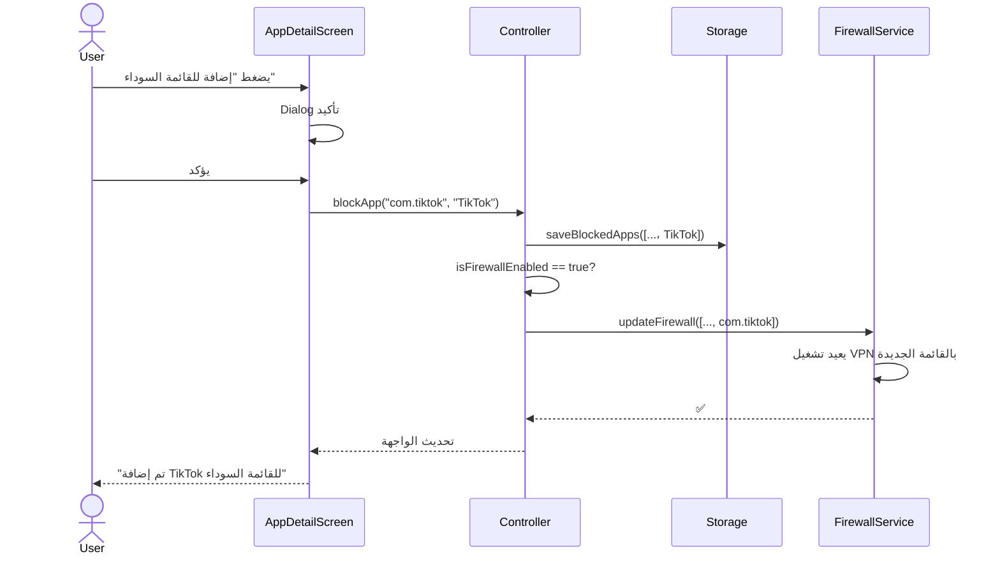
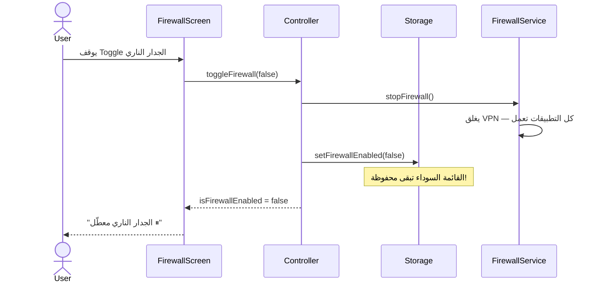
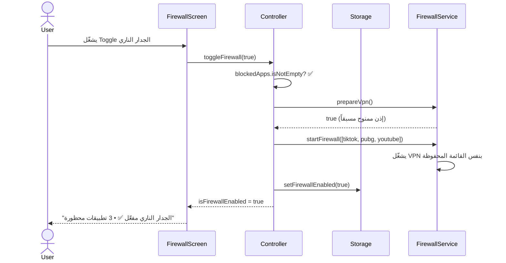

# 🛡️ نظام حظر التطبيقات من الإنترنت — App Blocking System
## الميزة الرئيسية للإصدار الثاني

---

## 📖 المفهوم

> إتاحة حظر تطبيق أو أكثر من الوصول للإنترنت محلياً عبر **Android VPNService**،
> مع إمكانية **تشغيل/إيقاف الجدار الناري** بشكل مستقل عن قائمة التطبيقات المحظورة.

### لماذا VPNService؟

| الميزة | التفاصيل |
|--------|---------|
| ❌ لا يحتاج Root | يعمل على أي جهاز أندرويد |
| ✅ API رسمي | مدعوم من Google، مستقر |
| ✅ حظر دقيق | `addAllowedApplication()` تحظر تطبيقات محددة بالاسم |
| ✅ محلي بالكامل | لا يُرسل بيانات لأي سيرفر — VPN "وهمي" داخل الجهاز |
| ✅ لا يمكن تجاوزه | التطبيق المحظور لا يملك طريقة للالتفاف |

### القيود المعروفة

| القيد | التوضيح |
|-------|---------|
| 🔑 أيقونة VPN | تظهر أيقونة مفتاح في شريط الحالة طوال فترة التشغيل |
| 🚫 VPN واحد فقط | لا يمكن استخدام VPN آخر (مثل NordVPN) أثناء تفعيل الجدار الناري |
| ⚙️ إيقاف من الإعدادات | المستخدم يمكنه إيقاف VPN من إعدادات النظام |

---

## 🏗️ كيف يعمل؟

```
┌─────────────────────────────────────┐
│           Android Device            │
│                                     │
│  ┌─────────┐    ┌─────────────────┐ │
│  │  App A   │    │    App B        │ │
│  │ (مسموح) │    │  (محظور)       │ │
│  └────┬─────┘    └───────┬────────┘ │
│       │                  │          │
│  ┌────▼──────────────────▼────────┐ │
│  │    Linkary VPN Firewall        │ │
│  │                                │ │
│  │  Blocked: [com.tiktok,         │ │
│  │            com.game.pubg]      │ │
│  │                                │ │
│  │  App A → ✅ PASS (لا يمر       │ │
│  │          عبر النفق أصلاً)      │ │
│  │  App B → 🚫 TRAPPED (يمر      │ │
│  │          عبر نفق بلا مخرج)     │ │
│  └────────────┬───────────────────┘ │
│               │                     │
│  ┌────────────▼───────────────────┐ │
│  │      WiFi Interface            │ │
│  │  (يرى فقط حركة App A)         │ │
│  └────────────────────────────────┘ │
└─────────────────────────────────────┘
```

### الآلية التقنية

1. نُنشئ **VPN محلي وهمي** — لا يتصل بأي سيرفر
2. نستخدم `addAllowedApplication(pkg)` لإجبار التطبيقات المحظورة فقط على المرور عبر النفق
3. بما أن النفق **لا يؤدي إلى أي مكان** ← التطبيقات المحظورة لا تملك إنترنت
4. التطبيقات غير المضافة للنفق تتجاوزه بالكامل ← إنترنت طبيعي

---

## 🔄 نموذج الحالة: الحظر مستقل عن التشغيل

```
┌─────────────────────────────────────────────┐
│          نموذج حالة الجدار الناري            │
│                                             │
│  blockedApps: [TikTok, PUBG, YouTube]       │
│  isFirewallEnabled: true/false              │
│                                             │
│  ┌──────────────────┬──────────────────┐    │
│  │  Firewall ON ✅   │  Firewall OFF ⏸  │   │
│  │                  │                  │    │
│  │ القائمة محفوظة   │ القائمة محفوظة   │   │
│  │ الحظر مفعّل      │ الحظر معطّل      │   │
│  │ VPN يعمل         │ VPN متوقف        │   │
│  │ 🔑 تظهر         │ 🔑 لا تظهر      │   │
│  └──────────────────┴──────────────────┘    │
│                                             │
│  الإجراءات الممكنة:                          │
│  • إضافة/إزالة تطبيق ← تحديث القائمة فقط   │
│  • تشغيل الجدار ← تفعيل VPN بالقائمة الحالية│
│  • إيقاف الجدار ← إيقاف VPN، القائمة تبقى  │
│  • تشغيل بعد إيقاف ← يُعاد بنفس القائمة    │
└─────────────────────────────────────────────┘
```

### السيناريوهات:

| الإجراء | القائمة | الجدار | النتيجة |
|---------|---------|--------|---------|
| حظر TikTok | +TikTok | ON → يبقى ON | TikTok محظور فوراً |
| إيقاف الجدار | تبقى كما هي | ON → OFF | كل التطبيقات تعمل مؤقتاً |
| تشغيل الجدار | تبقى كما هي | OFF → ON | TikTok محظور مجدداً |
| رفع حظر TikTok | -TikTok | ON → يبقى ON | TikTok يعمل فوراً |
| حظر تطبيق والجدار مطفأ | +App | OFF → يبقى OFF | يُضاف للقائمة فقط، لا حظر حتى التشغيل |
| إزالة كل التطبيقات | فارغة | ON → OFF تلقائي | لا حاجة لـ VPN |

---

## 🛠️ التصميم المعماري

### طبقة Domain

#### Entity: `BlockedApp`

```dart
class BlockedApp {
  final String packageName;
  final String appName;
  final DateTime blockedAt;

  const BlockedApp({
    required this.packageName,
    required this.appName,
    required this.blockedAt,
  });

  Map<String, dynamic> toJson() => {
    'packageName': packageName,
    'appName': appName,
    'blockedAt': blockedAt.toIso8601String(),
  };

  factory BlockedApp.fromJson(Map<String, dynamic> json) => BlockedApp(
    packageName: json['packageName'],
    appName: json['appName'],
    blockedAt: DateTime.parse(json['blockedAt']),
  );
}
```

#### Repository: `AppBlockingRepository`

```dart
abstract class AppBlockingRepository {
  // VPN Firewall Control
  Future<bool> prepareVpn();
  Future<bool> isFirewallRunning();
  Future<void> startFirewall(List<String> blockedPackages);
  Future<void> stopFirewall();
  Future<void> updateFirewall(List<String> blockedPackages);

  // Persistence — مستقل عن حالة الجدار
  Future<List<BlockedApp>> getBlockedApps();
  Future<void> saveBlockedApps(List<BlockedApp> apps);
  Future<void> setFirewallEnabled(bool enabled);
  Future<bool> getFirewallEnabled();
}
```

---

### طبقة Infrastructure

#### Android Native: `LinkaryFirewallService.kt`

```kotlin
class LinkaryFirewallService : VpnService() {

    companion object {
        var isRunning = false
            private set
    }

    private var vpnInterface: ParcelFileDescriptor? = null

    override fun onStartCommand(intent: Intent?, flags: Int, startId: Int): Int {
        when (intent?.action) {
            "START" -> {
                val apps = intent.getStringArrayListExtra("apps") ?: arrayListOf()
                startVpn(apps)
            }
            "UPDATE" -> {
                val apps = intent.getStringArrayListExtra("apps") ?: arrayListOf()
                restartVpn(apps)
            }
            "STOP" -> stopVpn()
        }
        return START_STICKY
    }

    private fun startVpn(blockedApps: List<String>) {
        if (blockedApps.isEmpty()) {
            stopVpn()
            return
        }

        val builder = Builder()
            .setSession("Linkary Shield")
            .addAddress("10.1.10.1", 32)
            .addRoute("0.0.0.0", 0)

        // المفتاح: فقط التطبيقات المحظورة تُجبر على المرور عبر النفق الوهمي
        for (pkg in blockedApps) {
            try {
                builder.addAllowedApplication(pkg)
            } catch (_: PackageManager.NameNotFoundException) {
                // تطبيق غير مثبت — تجاهل
            }
        }

        vpnInterface = builder.establish()
        isRunning = true
        showNotification(blockedApps.size)
    }

    private fun stopVpn() {
        vpnInterface?.close()
        vpnInterface = null
        isRunning = false
        stopForeground(STOP_FOREGROUND_REMOVE)
        stopSelf()
    }

    private fun restartVpn(blockedApps: List<String>) {
        vpnInterface?.close()
        startVpn(blockedApps)
    }

    private fun showNotification(count: Int) {
        val notification = NotificationCompat.Builder(this, "linkary_firewall")
            .setContentTitle("حماية Linkary نشطة")
            .setContentText("$count تطبيقات محظورة من الإنترنت")
            .setSmallIcon(R.drawable.ic_launcher_foreground)
            .setOngoing(true)
            .build()
        startForeground(9001, notification)
    }

    override fun onRevoke() {
        // المستخدم أوقف VPN من الإعدادات
        stopVpn()
    }
}
```

#### MethodChannel في `MainActivity.kt`

```kotlin
// إضافة بجانب CHANNEL الموجود
private val FIREWALL_CHANNEL = "com.linkary.mifi/firewall"

// في configureFlutterEngine:
MethodChannel(flutterEngine.dartExecutor.binaryMessenger, FIREWALL_CHANNEL)
    .setMethodCallHandler { call, result ->
        when (call.method) {
            "prepareVpn" -> {
                val intent = VpnService.prepare(this)
                if (intent != null) {
                    vpnPendingResult = result
                    startActivityForResult(intent, VPN_REQUEST_CODE)
                } else {
                    result.success(true)
                }
            }
            "startFirewall" -> {
                val apps = call.argument<List<String>>("apps") ?: emptyList()
                val i = Intent(this, LinkaryFirewallService::class.java)
                    .setAction("START")
                    .putStringArrayListExtra("apps", ArrayList(apps))
                startService(i)
                result.success(true)
            }
            "updateFirewall" -> {
                val apps = call.argument<List<String>>("apps") ?: emptyList()
                val i = Intent(this, LinkaryFirewallService::class.java)
                    .setAction("UPDATE")
                    .putStringArrayListExtra("apps", ArrayList(apps))
                startService(i)
                result.success(true)
            }
            "stopFirewall" -> {
                val i = Intent(this, LinkaryFirewallService::class.java).setAction("STOP")
                startService(i)
                result.success(true)
            }
            "isFirewallActive" -> {
                result.success(LinkaryFirewallService.isRunning)
            }
            else -> result.notImplemented()
        }
    }
```

#### Flutter Data Sources

**`firewall_native_data_source.dart`**:
```dart
class FirewallNativeDataSource {
  static const _channel = MethodChannel('com.linkary.mifi/firewall');

  Future<bool> prepareVpn() async =>
      await _channel.invokeMethod('prepareVpn') ?? false;

  Future<void> startFirewall(List<String> apps) async =>
      await _channel.invokeMethod('startFirewall', {'apps': apps});

  Future<void> updateFirewall(List<String> apps) async =>
      await _channel.invokeMethod('updateFirewall', {'apps': apps});

  Future<void> stopFirewall() async =>
      await _channel.invokeMethod('stopFirewall');

  Future<bool> isFirewallActive() async =>
      await _channel.invokeMethod('isFirewallActive') ?? false;
}
```

**`blocked_apps_storage.dart`**:
```dart
class BlockedAppsStorage {
  static const _appsKey = 'mifi_firewall_blocked_apps';
  static const _enabledKey = 'mifi_firewall_enabled';

  SharedPreferences? _prefs;
  Future<SharedPreferences> get _storage async {
    _prefs ??= await SharedPreferences.getInstance();
    return _prefs!;
  }

  // --- قائمة التطبيقات المحظورة (مستقلة عن حالة الجدار) ---

  Future<List<BlockedApp>> getBlockedApps() async {
    final prefs = await _storage;
    final json = prefs.getString(_appsKey);
    if (json == null) return [];
    final list = jsonDecode(json) as List;
    return list.map((e) => BlockedApp.fromJson(e)).toList();
  }

  Future<void> saveBlockedApps(List<BlockedApp> apps) async {
    final prefs = await _storage;
    await prefs.setString(
      _appsKey,
      jsonEncode(apps.map((e) => e.toJson()).toList()),
    );
  }

  // --- حالة الجدار الناري (تشغيل/إيقاف) ---

  Future<void> setFirewallEnabled(bool enabled) async {
    final prefs = await _storage;
    await prefs.setBool(_enabledKey, enabled);
  }

  Future<bool> getFirewallEnabled() async {
    final prefs = await _storage;
    return prefs.getBool(_enabledKey) ?? false;
  }
}
```

---

### طبقة Presentation

#### منطق الحظر في Controller

```dart
// === متغيرات جديدة ===
var blockedApps = <BlockedApp>[].obs;
var isFirewallEnabled = false.obs;

// === التهيئة ===
Future<void> _initFirewall() async {
  blockedApps.value = await blockingRepo.getBlockedApps();
  isFirewallEnabled.value = await blockingRepo.getFirewallEnabled();

  // استعادة الحالة: إذا كان مفعلاً مع وجود تطبيقات، أعد تشغيل VPN
  if (isFirewallEnabled.value && blockedApps.isNotEmpty) {
    final isActuallyRunning = await blockingRepo.isFirewallRunning();
    if (!isActuallyRunning) {
      await blockingRepo.startFirewall(_blockedPackages);
    }
  }
}

List<String> get _blockedPackages =>
    blockedApps.map((b) => b.packageName).toList();

// === حظر تطبيق ===
Future<void> blockApp(String packageName, String appName) async {
  // تجنب التكرار
  if (blockedApps.any((b) => b.packageName == packageName)) return;

  // إضافة للقائمة
  blockedApps.add(BlockedApp(
    packageName: packageName,
    appName: appName,
    blockedAt: DateTime.now(),
  ));
  await blockingRepo.saveBlockedApps(blockedApps);

  // إذا الجدار مفعل، حدّث VPN فوراً
  if (isFirewallEnabled.value) {
    await blockingRepo.updateFirewall(_blockedPackages);
  }
}

// === رفع الحظر عن تطبيق ===
Future<void> unblockApp(String packageName) async {
  blockedApps.removeWhere((b) => b.packageName == packageName);
  await blockingRepo.saveBlockedApps(blockedApps);

  if (isFirewallEnabled.value) {
    if (blockedApps.isEmpty) {
      // لا تطبيقات محظورة — أوقف VPN تلقائياً
      await blockingRepo.stopFirewall();
      isFirewallEnabled.value = false;
      await blockingRepo.setFirewallEnabled(false);
    } else {
      await blockingRepo.updateFirewall(_blockedPackages);
    }
  }
}

// === تشغيل/إيقاف الجدار الناري (مع حفظ القائمة) ===
Future<void> toggleFirewall(bool enabled) async {
  if (enabled) {
    if (blockedApps.isEmpty) {
      Get.snackbar('⚠️', 'أضف تطبيقاً واحداً على الأقل قبل تشغيل الجدار الناري');
      return;
    }

    // طلب إذن VPN إذا لم يُمنح
    final prepared = await blockingRepo.prepareVpn();
    if (!prepared) {
      Get.snackbar('خطأ', 'يجب الموافقة على إذن VPN لتفعيل الحظر');
      return;
    }

    await blockingRepo.startFirewall(_blockedPackages);
  } else {
    await blockingRepo.stopFirewall();
  }

  isFirewallEnabled.value = enabled;
  await blockingRepo.setFirewallEnabled(enabled);
}

// === هل التطبيق محظور حالياً؟ ===
bool isAppBlocked(String packageName) =>
    blockedApps.any((b) => b.packageName == packageName);

bool isAppEffectivelyBlocked(String packageName) =>
    isFirewallEnabled.value && isAppBlocked(packageName);
```

---

## 🎨 واجهة المستخدم

### 1. بطاقة الحظر في شاشة تفاصيل التطبيق

```
┌─────────────────────────────────────┐
│  🛡️ التحكم بالوصول للإنترنت        │
│                                     │
│  ┌─ الحالة ────────────────────┐   │
│  │                              │   │
│  │  🟢 مسموح / 🔴 محظور       │   │
│  │                              │   │
│  │  [ إضافة للقائمة السوداء ]   │   │
│  │  أو                          │   │
│  │  [ إزالة من القائمة ──○ ]    │   │
│  │                              │   │
│  └──────────────────────────────┘   │
│                                     │
│  💡 ملاحظة: يجب تشغيل الجدار       │
│  الناري من شاشة الإدارة لتفعيل     │
│  الحظر فعلياً.                      │
└─────────────────────────────────────┘
```

### 2. شاشة إدارة الجدار الناري

```
┌─────────────────────────────────────┐
│    🛡️ جدار حماية التطبيقات         │
│                                     │
│  ┌───────────────────────────────┐  │
│  │  الجدار الناري                │  │
│  │                               │  │
│  │  ⏸ معطّل   [────●] مفعّل ✅  │  │
│  │                               │  │
│  │  3 تطبيقات في القائمة السوداء │  │
│  │                               │  │
│  │  💡 عند التشغيل، ستظهر       │  │
│  │  أيقونة 🔑 في شريط الحالة    │  │
│  └───────────────────────────────┘  │
│                                     │
│  ── القائمة السوداء ───────────── │
│                                     │
│  🎮 PUBG Mobile                     │
│     محظور منذ 20 أبريل        [✕]  │
│                                     │
│  📱 TikTok                          │
│     محظور منذ 19 أبريل        [✕]  │
│                                     │
│  🎞 YouTube                         │
│     محظور منذ 18 أبريل        [✕]  │
│                                     │
│  ─────────────────────────────────  │
│                                     │
│  [ ＋ إضافة تطبيق للقائمة السوداء ] │
│                                     │
└─────────────────────────────────────┘
```

### 3. Dialog إضافة تطبيق

```
┌─────────────────────────────────────┐
│  إضافة تطبيق للقائمة السوداء       │
│                                     │
│  🔍 [ابحث عن تطبيق...]             │
│                                     │
│  ┌───────────────────────────────┐  │
│  │ 💬 WhatsApp              [+] │  │
│  │ 🎞 Netflix               [+] │  │
│  │ 🎮 Clash of Clans        [+] │  │
│  │ 🌐 Chrome                [+] │  │
│  │ 📱 Instagram             [+] │  │
│  │ ...                          │  │
│  └───────────────────────────────┘  │
│                                     │
│  يعرض التطبيقات من قائمة المراقب   │
│  (التطبيقات التي استهلكت بيانات)   │
│                                     │
└─────────────────────────────────────┘
```

---

## 📋 التسلسل الوظيفي

### سيناريو 1: حظر تطبيق (الجدار مفعّل)



### سيناريو 2: إيقاف الجدار (مع حفظ القائمة)



### سيناريو 3: إعادة تشغيل الجدار



---

## 📋 قائمة الملفات المطلوبة

### Android Native (Kotlin)

| الملف | الوصف | الحالة |
|---|---|---|
| `LinkaryFirewallService.kt` | خدمة VPN — التشغيل/الإيقاف/التحديث | جديد |
| `MainActivity.kt` | إضافة `FIREWALL_CHANNEL` MethodChannel | تعديل |
| `AndroidManifest.xml` | إضافة أذونات + تسجيل الخدمة | تعديل |

### Domain Layer (Dart)

| الملف | الوصف | الحالة |
|---|---|---|
| `entities/blocked_app.dart` | كيان التطبيق المحظور | جديد |
| `repositories/app_blocking_repository.dart` | واجهة المستودع | جديد |

### Infrastructure Layer (Dart)

| الملف | الوصف | الحالة |
|---|---|---|
| `data_sources/firewall_native_data_source.dart` | MethodChannel للـ VPN | جديد |
| `data_sources/blocked_apps_storage.dart` | تخزين القائمة وحالة الجدار | جديد |
| `repositories/app_blocking_repository_impl.dart` | تنفيذ المستودع | جديد |

### Presentation Layer (Dart)

| الملف | الوصف | الحالة |
|---|---|---|
| `pages/firewall_management_screen.dart` | شاشة إدارة الجدار الناري | جديد |
| `widgets/block_toggle_card.dart` | بطاقة الحظر في شاشة التفاصيل | جديد |
| `app_monitor_controller.dart` | إضافة منطق الحظر + Firewall toggle | تعديل |
| `app_detail_screen.dart` | إضافة بطاقة الحظر | تعديل |
| `injection_container.dart` | تسجيل DI | تعديل |

---

## ⚙️ تعديلات AndroidManifest.xml

```xml
<!-- أذونات -->
<uses-permission android:name="android.permission.FOREGROUND_SERVICE" />
<uses-permission android:name="android.permission.FOREGROUND_SERVICE_SPECIAL_USE" />

<!-- تسجيل خدمة VPN -->
<service
    android:name=".LinkaryFirewallService"
    android:permission="android.permission.BIND_VPN_SERVICE"
    android:foregroundServiceType="specialUse"
    android:exported="false">
    <intent-filter>
        <action android:name="android.net.VpnService" />
    </intent-filter>
</service>
```

---

## ⚠️ اعتبارات مهمة

### 1. سياسة Google Play
- استخدام VPNService كجدار ناري محلي مسموح (parental control / firewall)
- يجب الإفصاح في Data Safety أن التطبيق يستخدم VPN
- **لا يُرسل بيانات لأي سيرفر** — هذا الشرط الأساسي للقبول

### 2. تجربة المستخدم
- شرح واضح عند أول استخدام: "ستظهر أيقونة 🔑"
- التمييز الواضح بين "القائمة السوداء" و "حالة الجدار"
- رسائل تأكيد قبل الحظر وبعده
- إظهار أن القائمة محفوظة حتى لو الجدار مطفأ

### 3. التوافق
- **Android 5+ (API 21+)**: VPNService متاح
- **لا يحتاج صلاحيات خاصة**: فقط VPN permission (إذن عادي يُطلب مرة واحدة)
- لا يتعارض مع ميزة مراقبة الاستهلاك الموجودة

### 4. Persistence عبر إعادة التشغيل
- القائمة محفوظة في SharedPreferences
- عند فتح التطبيق، يتحقق من الحالة المحفوظة ويُعيد تشغيل VPN إذا كان مفعلاً
- إذا أوقف المستخدم VPN من إعدادات النظام ← `onRevoke()` يُحدّث الحالة
