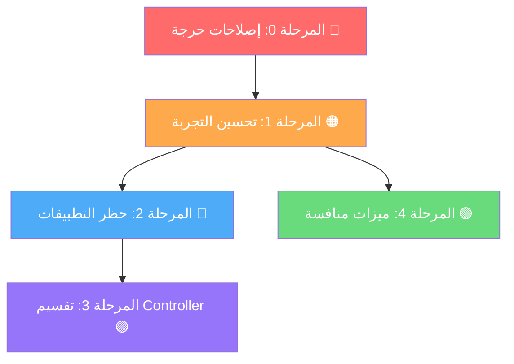

# 🚀 مراحل التنفيذ — Implementation Phases
## الإصدار الثاني: الحماية والتحكم الكامل

---

## الفلسفة

> كل مرحلة تُنتج نسخة **عاملة ومستقرة**.
> الأولوية: إصلاح المشاكل أولاً → ثم الحظر → ثم التلميع.
> *لا يتم الانتقال للمرحلة التالية إلا بعد اختبار السابقة.*

---

## المرحلة 0: إصلاحات حرجة وتنظيف 🔴
**المدة المقدرة**: 2-3 ساعات
**الهدف**: إصلاح المشاكل المتبقية التي تؤثر على الدقة والأداء

### المهام:

#### 0.1 • إصلاح حساب السرعة غير الدقيق (W3)

**المشكلة**: `formatSpeed` يفترض دائماً أن الفاصل 3 ثوانٍ بالضبط.

**الإصلاح**: تتبع الزمن الفعلي بين كل poll.

| الملف | التغيير |
|---|---|
| `app_monitor_controller.dart` | إضافة `_lastPollTime` + حساب `elapsedSeconds` الفعلي |
| `calculate_usage_delta_usecase.dart` | إضافة parameter `intervalSeconds` لحساب السرعة |
| `app_monitor_controller.dart:508` | تعديل `formatSpeed` ليستقبل bytes/s مباشرة |

---

#### 0.2 • إصلاح Delta لا ينقل Category (W5)

**المشكلة**: `CalculateUsageDeltaUseCase` يُنشئ entities جديدة بدون نقل `category`, `isSystemApp`, `lastActiveTime`.

| الملف | التغيير |
|---|---|
| `calculate_usage_delta_usecase.dart:34` | إضافة 3 حقول للـ constructor |

```dart
// إضافة هذه الأسطر في AppUsageEntity constructor داخل delta:
category: currentApp.category,
isSystemApp: currentApp.isSystemApp,
lastActiveTime: currentApp.lastActiveTime,
```

---

#### 0.3 • إصلاح Clean Architecture violation (W6)

**المشكلة**: `CategorizeAppsUseCase` (Domain) يستورد `AppCategoryMapper` (Infrastructure) مباشرة.

| الملف | التغيير |
|---|---|
| `domain/services/app_category_classifier.dart` | **جديد** — واجهة abstract في Domain |
| `infrastructure/mappers/app_category_mapper.dart` | يُنفّذ الواجهة `implements AppCategoryClassifier` |
| `categorize_apps_usecase.dart` | يستقبل `AppCategoryClassifier` كحقن بدلاً من استيراد مباشر |
| `injection_container.dart` | تسجيل الحقن |

---

#### 0.4 • إصلاح Week/Month Aggregation البطيء (W10)

**المشكلة**: 30 عملية `await` متتالية في حلقة.

| الملف | التغيير |
|---|---|
| `app_monitor_controller.dart:250` | استخدام `Future.wait` للتوازي |

```dart
// بدلاً من:
for (int i = 1; i < aggregationDays; i++) {
  final dailyMap = await repository.getDailyAppTotals(date);
}

// يصبح:
final results = await Future.wait(
  List.generate(aggregationDays - 1, (i) {
    final date = DateTime.now().subtract(Duration(days: i + 1));
    return repository.getDailyAppTotals(date);
  }),
);
```

---

#### 0.5 • Theme Constants مركزية (W8)

**المشكلة**: نفس كود الألوان يتكرر في 10+ ملفات.

| الملف | التغيير |
|---|---|
| `widgets/monitor_theme.dart` | **جديد** — `MonitorTheme` static class |
| كل الـ widgets | استبدال الألوان المكررة بـ `MonitorTheme.xxx(context)` |

---

#### 0.6 • تنظيف: دوال مكررة (W9) + مسح بحث عند تغيير فلتر (W16)

| الملف | التغيير |
|---|---|
| `app_monitor_controller.dart:132` | إضافة `searchQuery.value = ''` في `changeFilter()` |
| `app_detail_screen.dart:220` | حذف `_getArabicDayShort` المكررة، استخدام نسخة مشتركة |

---

#### 0.7 • إضافة `copyWith` للكيان

| الملف | التغيير |
|---|---|
| `app_usage_entity.dart` | إضافة `copyWith()` method |

---

**📦 ملخص المرحلة 0:**

| النوع | العدد | الملفات |
|---|---|---|
| ملفات جديدة | 2 | `app_category_classifier.dart`, `monitor_theme.dart` |
| ملفات معدلة | 6 | controller, delta usecase, categorize usecase, entity, mapper, DI |

**✅ معايير القبول:**
- [ ] السرعة المعروضة تتطابق مع speedtest تقريبياً (± 10%)
- [ ] تصنيف التطبيقات يظهر بشكل صحيح في كل الفلاتر
- [ ] عرض الشهر لا يتجمد (< 500ms)
- [ ] لا أخطاء في `flutter analyze`
- [ ] لا تكرار ألوان في أي ملف widget

---

## المرحلة 1: تحسين التجربة والمتانة 🟠
**المدة المقدرة**: 3-4 ساعات
**الهدف**: Error states + فلتر بالفئة + تفاصيل حية + mapper أغنى

### المهام:

#### 1.1 • نظام حالات شامل (W4)

| الملف | التغيير |
|---|---|
| `app_monitor_controller.dart` | إضافة `MonitorState` enum + `monitorState.obs` + `errorMessage.obs` |
| `widgets/error_state_widget.dart` | **جديد** — واجهة خطأ مع زر إعادة المحاولة |
| `widgets/empty_state_widget.dart` | **جديد** — واجهة "لا بيانات بعد" |
| `app_monitor_screen.dart` | تعديل `Obx` الرئيسي لدعم 5 حالات |

```dart
enum MonitorState { loading, ready, error, noPermission, empty }
```

---

#### 1.2 • فلتر حسب الفئة

| الملف | التغيير |
|---|---|
| `app_monitor_controller.dart` | إضافة `selectedCategory` + تعديل `_applyFilter()` |
| `widgets/category_filter_chips.dart` | **جديد** — شرائح فئات أفقية |
| `app_monitor_screen.dart` | إضافة `CategoryFilterChips` بعد `FilterChipsBar` |

```
[الكل] [💬 اجتماعي] [🎞 بث] [🎮 ألعاب] [🔒 VPN] [🛠 نظام] [📱 أخرى]
```

---

#### 1.3 • شاشة تفاصيل حية (W7)

| الملف | التغيير |
|---|---|
| `app_detail_screen.dart` | لف المحتوى بـ `Obx` + جلب البيانات المحدّثة من `controller.appsUsage` |

```dart
AppUsageEntity get _liveApp =>
  controller.appsUsage.firstWhere(
    (a) => a.packageName == widget.app.packageName,
    orElse: () => widget.app,
  );
```

---

#### 1.4 • تحسين CategoryMapper (W14)

| الملف | التغيير |
|---|---|
| `app_category_mapper.dart` | إضافة 40+ تطبيق شائع عربياً وعالمياً |

إضافات: TikTok (الاسم الحقيقي)، شاهد، أنغامي، أبشر، توكلنا، STC Pay، الراجحي، PUBG، Samsung Browser، Edge، NordVPN، Zoom، Duolingo، Discord، Reddit...

---

**📦 ملخص المرحلة 1:**

| النوع | العدد | الملفات |
|---|---|---|
| ملفات جديدة | 3 | `error_state_widget`, `empty_state_widget`, `category_filter_chips` |
| ملفات معدلة | 4 | controller, detail screen, main screen, mapper |

**✅ معايير القبول:**
- [ ] حالة الخطأ تظهر مع زر إعادة المحاولة
- [ ] حالة "لا بيانات" تظهر عند عدم وجود استهلاك
- [ ] الفلتر بالفئة يعمل **مع** البحث النصي و **مع** الفلتر الزمني
- [ ] شاشة التفاصيل تُحدَّث كل 3 ثوانٍ
- [ ] Mapper يتعرف على 60+ تطبيق شائع

---

## المرحلة 2: نظام حظر التطبيقات 🔵
**المدة المقدرة**: 8-10 ساعات
**الهدف**: تنفيذ Local VPN Firewall مع toggle مستقل عن القائمة

> **المرجع التفصيلي**: [02_app_blocking_system.md](./02_app_blocking_system.md)

### 2.1 • Android Native (Kotlin)

| الملف | الحالة | المحتوى |
|---|---|---|
| `LinkaryFirewallService.kt` | **جديد** | خدمة VPN: `startVpn()`, `stopVpn()`, `restartVpn()`, `onRevoke()` |
| `MainActivity.kt` | **تعديل** | إضافة `FIREWALL_CHANNEL` مع 5 methods |
| `AndroidManifest.xml` | **تعديل** | أذونات + تسجيل الخدمة + Notification Channel |

**تفاصيل AndroidManifest:**
```xml
<uses-permission android:name="android.permission.FOREGROUND_SERVICE" />
<uses-permission android:name="android.permission.FOREGROUND_SERVICE_SPECIAL_USE" />

<service
    android:name=".LinkaryFirewallService"
    android:permission="android.permission.BIND_VPN_SERVICE"
    android:foregroundServiceType="specialUse"
    android:exported="false">
    <intent-filter>
        <action android:name="android.net.VpnService" />
    </intent-filter>
</service>
```

**MethodChannel methods:**

| Method | المعاملات | الوظيفة |
|---|---|---|
| `prepareVpn` | — | يطلب إذن VPN (مرة واحدة) |
| `startFirewall` | `apps: List<String>` | يشغّل VPN مع القائمة |
| `updateFirewall` | `apps: List<String>` | يُحدّث القائمة بدون إيقاف |
| `stopFirewall` | — | يوقف VPN |
| `isFirewallActive` | — | هل VPN يعمل؟ |

---

### 2.2 • Domain Layer (Dart)

| الملف | الحالة |
|---|---|
| `domain/entities/blocked_app.dart` | **جديد** — كيان بسيط: `packageName`, `appName`, `blockedAt` + `toJson`/`fromJson` |
| `domain/repositories/app_blocking_repository.dart` | **جديد** — واجهة: VPN control + Persistence |

---

### 2.3 • Infrastructure Layer (Dart)

| الملف | الحالة |
|---|---|
| `infrastructure/data_sources/firewall_native_data_source.dart` | **جديد** — MethodChannel wrapper |
| `infrastructure/data_sources/blocked_apps_storage.dart` | **جديد** — قائمة محظورة + حالة الجدار (SharedPreferences) |
| `infrastructure/repositories/app_blocking_repository_impl.dart` | **جديد** — يجمع Native + Storage |

**نموذج التخزين:**
```
SharedPreferences:
  mifi_firewall_blocked_apps  → JSON array of BlockedApp
  mifi_firewall_enabled       → bool (حالة التشغيل/الإيقاف)
```

---

### 2.4 • Presentation Layer (Dart)

| الملف | الحالة | المحتوى |
|---|---|---|
| `app_monitor_controller.dart` | **تعديل** | إضافة: `blockedApps.obs`, `isFirewallEnabled.obs`, `blockApp()`, `unblockApp()`, `toggleFirewall()`, `_initFirewall()` |
| `app_detail_screen.dart` | **تعديل** | إضافة `_buildBlockCard()` — بطاقة إضافة/إزالة من القائمة السوداء |
| `pages/firewall_management_screen.dart` | **جديد** | شاشة كاملة: toggle رئيسي + قائمة محظورة + إضافة تطبيق |
| `widgets/block_toggle_card.dart` | **جديد** | بطاقة الحظر القابلة لإعادة الاستخدام |
| `injection_container.dart` | **تعديل** | تسجيل DI: `FirewallNativeDataSource`, `BlockedAppsStorage`, `AppBlockingRepository` |

---

### 2.5 • منطق Toggle المستقل

```
                    ┌──────────────────────┐
                    │    blockedApps[]      │
                    │  (محفوظة دائماً)      │
                    └──────────┬───────────┘
                               │
              ┌────────────────┼────────────────┐
              │                │                │
    ┌─────────▼──────┐ ┌──────▼─────────┐ ┌────▼──────────┐
    │  blockApp()    │ │ unblockApp()   │ │ toggleFirewall│
    │                │ │                │ │               │
    │ 1. أضف للقائمة │ │ 1. احذف من     │ │ enabled=true: │
    │ 2. احفظ        │ │    القائمة     │ │  startVPN()   │
    │ 3. if enabled: │ │ 2. احفظ        │ │               │
    │    updateVPN() │ │ 3. if enabled: │ │ enabled=false:│
    └────────────────┘ │    updateVPN() │ │  stopVPN()    │
                       │ 4. if empty:   │ │               │
                       │    stopVPN()   │ │ القائمة تبقى  │
                       └────────────────┘ └───────────────┘
```

**الحالات الحدّية:**

| الحالة | السلوك |
|---|---|
| حظر تطبيق + الجدار مطفأ | يُضاف للقائمة فقط، لا VPN |
| تشغيل الجدار + قائمة فارغة | رسالة: "أضف تطبيقاً أولاً" |
| إزالة آخر تطبيق + الجدار مفعل | إيقاف VPN تلقائياً |
| المستخدم أوقف VPN من الإعدادات | `onRevoke()` → تحديث `isFirewallEnabled = false` |
| إعادة فتح التطبيق | يتحقق من الحالة المحفوظة → يُعيد تشغيل VPN إذا لزم |

---

**📦 ملخص المرحلة 2:**

| النوع | العدد | الملفات |
|---|---|---|
| ملفات Kotlin جديدة | 1 | `LinkaryFirewallService.kt` |
| ملفات Kotlin معدلة | 1 | `MainActivity.kt` |
| ملفات XML معدلة | 1 | `AndroidManifest.xml` |
| ملفات Dart جديدة | 6 | entity, repository interface, data source ×2, repo impl, firewall screen |
| ملفات Dart معدلة | 3 | controller, detail screen, DI |

**✅ معايير القبول:**
- [ ] يمكن إضافة تطبيق للقائمة السوداء من شاشة التفاصيل
- [ ] يمكن إزالة تطبيق من القائمة السوداء
- [ ] Toggle التشغيل/الإيقاف يعمل **بدون** فقدان القائمة
- [ ] التطبيق المحظور **فعلاً** لا يصل للإنترنت عند تشغيل الجدار
- [ ] رفع الحظر أو إيقاف الجدار يُعيد الإنترنت فوراً
- [ ] الإشعار الدائم يظهر عند تفعيل الجدار
- [ ] القائمة + حالة الجدار تبقيان بعد إغلاق وفتح التطبيق
- [ ] إذا أُوقف VPN من الإعدادات، يُحدَّث الـ toggle تلقائياً
- [ ] لا يتعارض مع مراقبة الاستهلاك الموجودة

---

## المرحلة 3: تقسيم Controller 🟣
**المدة المقدرة**: 4-5 ساعات
**الهدف**: تقليل Controller من 514+ سطر إلى ~250 سطر

### المهام:

#### 3.1 • استخراج UsageDataEngine

| الملف | الحالة |
|---|---|
| `domain/services/usage_data_engine.dart` | **جديد** |

```dart
class UsageDataEngine {
  final AppMonitorRepository repository;
  final CalculateUsageDeltaUseCase deltaUseCase;
  final ModemSessionService sessionService;

  /// يجلب البيانات الخام ويحسب session delta + today delta
  Future<UsageSnapshot> fetchAndProcess({
    required Map<String, List<int>>? sessionBaseline,
    required Map<String, List<int>> dailyBaseline,
    required Map<String, List<int>>? previousStats,
    required double intervalSeconds,
  }) async { ... }
}

class UsageSnapshot {
  final List<AppUsageEntity> sessionDelta;
  final List<AppUsageEntity> todayDelta;
  final List<AppUsageEntity> rawBootStats;
  final Map<String, List<int>> newPreviousStats;
  final int currentUptime;
  final bool modemRestarted;
}
```

**ينقل من Controller**: خطوات 1-3 من `refreshUsage()` (~80 سطر)

---

#### 3.2 • استخراج UsageAggregator

| الملف | الحالة |
|---|---|
| `domain/services/usage_aggregator.dart` | **جديد** |

```dart
class UsageAggregator {
  final AppMonitorRepository repository;

  /// يجمّع البيانات حسب الفلتر (session/today/week/month)
  Future<AggregatedResult> aggregate({
    required MonitorFilter filter,
    required List<AppUsageEntity> sessionDelta,
    required List<AppUsageEntity> todayDelta,
    required List<AppUsageEntity> rawBootStats,
  }) async { ... }
}

class AggregatedResult {
  final List<AppUsageEntity> apps;
  final int totalRx;
  final int totalTx;
}
```

**ينقل من Controller**: خطوات 4-7 من `refreshUsage()` (~100 سطر)

---

#### 3.3 • Controller المبسّط

```dart
Future<void> refreshUsage() async {
  try {
    // 1. جلب ومعالجة (كان 80 سطر → 5 أسطر)
    final snapshot = await _dataEngine.fetchAndProcess(
      sessionBaseline: _sessionBaselineMap,
      dailyBaseline: _dailyBaselineMap,
      previousStats: _previousStatsMap,
      intervalSeconds: _getElapsedSeconds(),
    );

    // 2. تجميع (كان 100 سطر → 3 أسطر)
    final aggregated = await _aggregator.aggregate(
      filter: selectedFilter.value,
      sessionDelta: snapshot.sessionDelta,
      todayDelta: snapshot.todayDelta,
      rawBootStats: snapshot.rawBootStats,
    );

    // 3. تصنيف + تحديث UI (30 سطر)
    final categorized = categorizeUseCase.execute(aggregated.apps);
    _updateState(snapshot, categorized, aggregated);
    _checkUsageAlerts();
    _applyFilter();

    monitorState.value = MonitorState.ready;
  } catch (e) {
    monitorState.value = MonitorState.error;
    errorMessage.value = e.toString();
  }
}
```

---

**📦 ملخص المرحلة 3:**

| النوع | العدد | الملفات |
|---|---|---|
| ملفات جديدة | 2 | `usage_data_engine.dart`, `usage_aggregator.dart` |
| ملفات معدلة | 2 | controller, DI |

**✅ معايير القبول:**
- [ ] `refreshUsage()` < 50 سطر
- [ ] Controller < 300 سطر (بدون التعليقات)
- [ ] كل الوظائف تعمل كما كانت — **لا regression**
- [ ] `UsageDataEngine` و `UsageAggregator` قابلة للاختبار المنفصل

---

## المرحلة 4: ميزات منافسة 🟢
**المدة المقدرة**: 5-7 ساعات
**الهدف**: إضافة ميزات تُميّز التطبيق

### 4.1 • إشعارات Push محلية

| الملف | التغيير |
|---|---|
| `pubspec.yaml` | إضافة `flutter_local_notifications` |
| `domain/services/notification_service.dart` | **جديد** — خدمة إشعارات |
| `app_monitor_controller.dart` | ربط التنبيهات مع push notifications |

**الإشعارات:**
- تنبيه عند تجاوز سقف الاستهلاك لتطبيق
- تنبيه عند اكتشاف Spike مفاجئ

---

### 4.2 • تصدير البيانات CSV

| الملف | التغيير |
|---|---|
| `domain/services/report_export_service.dart` | **جديد** — توليد CSV |
| `app_monitor_screen.dart` | إضافة زر "تصدير" في AppBar |

---

### 4.3 • تحليل أنماط الاستخدام

| الملف | التغيير |
|---|---|
| `domain/services/usage_pattern_analyzer.dart` | **جديد** — مقارنة اليوم مع المعدل |
| `widgets/insight_card.dart` | **جديد** — "📈 استهلاك أعلى من المعتاد بـ 23%" |

---

### 4.4 • تحسين الرسوم البيانية

| الملف | التغيير |
|---|---|
| `app_monitor_screen.dart` | تأثيرات gradient على الأعمدة |
| `app_detail_screen.dart` | Touch tooltip أفضل |

---

**📦 ملخص المرحلة 4:**

| النوع | العدد | الملفات |
|---|---|---|
| ملفات جديدة | 4 | notification service, export service, pattern analyzer, insight card |
| ملفات معدلة | 3 | controller, main screen, detail screen |

**✅ معايير القبول:**
- [ ] الإشعارات تعمل عند تجاوز السقف (التطبيق في الخلفية)
- [ ] ملف CSV قابل للفتح في Excel/Google Sheets
- [ ] بطاقة "Insight" تعرض مقارنة ذكية دقيقة

---

## 📊 ملخص جميع المراحل

| المرحلة | الاسم | الجهد | ملفات جديدة | ملفات معدلة | الأولوية |
|---------|-------|-------|------------|------------|----------|
| 0 | إصلاحات حرجة | 3 ساعات | 2 | 6 | 🔴 فوري |
| 1 | تحسين التجربة | 4 ساعات | 3 | 4 | 🟠 مهم |
| 2 | حظر التطبيقات | 10 ساعات | 7 Dart + 1 Kotlin | 3 Dart + 2 Native | 🔵 رئيسي |
| 3 | تقسيم Controller | 5 ساعات | 2 | 2 | 🟣 هيكلي |
| 4 | ميزات منافسة | 7 ساعات | 4 | 3 | 🟢 تحسين |
| **المجموع** | | **~29 ساعة** | **19 ملف** | **20 تعديل** | |

---

## 🗺️ خريطة التبعيات بين المراحل



> **ملاحظة**: المرحلة 4 يمكن تنفيذها **بالتوازي** مع المرحلة 3 — لا تعتمد على بعضها.

---

## ✅ معايير القبول النهائية (بعد جميع المراحل)

### الوظائف الأساسية
- [ ] مراقبة استهلاك كل تطبيق بدقة (session / يوم / أسبوع / شهر)
- [ ] حظر أي تطبيق من الإنترنت عبر VPN محلي
- [ ] تشغيل/إيقاف الجدار بدون فقدان القائمة السوداء
- [ ] تنبيهات ذكية (سقف، spike)
- [ ] تقارير قابلة للمشاركة

### الأداء
- [ ] عرض الشهر < 500ms
- [ ] لا jank عند التمرير (60 FPS)
- [ ] VPN لا يبطئ التطبيقات غير المحظورة

### الكود
- [ ] Controller < 300 سطر
- [ ] كل class يتبع SRP (مسؤولية واحدة)
- [ ] `flutter analyze` بدون أخطاء
- [ ] لا Clean Architecture violations
