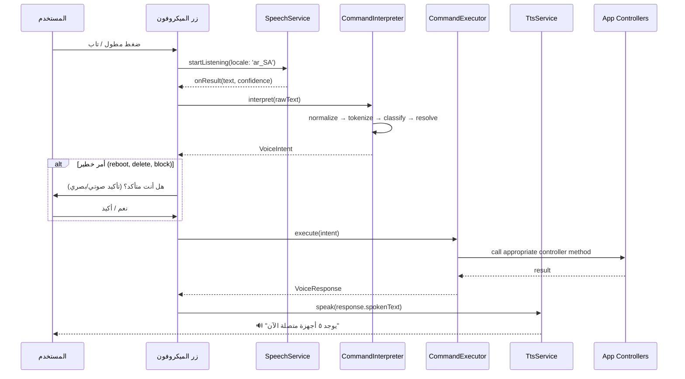

# 🏗️ البنية المعمارية — Voice Assistant Architecture

## 1. المخطط العام

```
┌─────────────────────────────────────────────────────┐
│                  Presentation Layer                  │
│                                                     │
│  ┌──────────────┐   ┌───────────────────────────┐   │
│  │ VoiceFAB     │──▶│ VoiceAssistantBottomSheet  │   │
│  │ (زر عائم)    │   │ (واجهة المساعد الصوتي)     │   │
│  └──────────────┘   └───────────┬───────────────┘   │
│                                 │                   │
│              ┌──────────────────┴──────────────┐    │
│              │  VoiceAssistantController       │    │
│              │  (GetxController)               │    │
│              │  - إدارة حالة الاستماع          │    │
│              │  - تنسيق STT ↔ NLP ↔ TTS       │    │
│              │  - محفوظات الأوامر              │    │
│              └──────────┬─────────────────────┘    │
│                         │                          │
├─────────────────────────┼──────────────────────────┤
│                   Domain Layer                      │
│                         │                          │
│  ┌──────────────────────┴──────────────────────┐   │
│  │         VoiceCommandInterpreter             │   │
│  │         (محرك فهم الأوامر)                   │   │
│  │                                             │   │
│  │  ┌─────────┐  ┌──────────┐  ┌───────────┐  │   │
│  │  │Tokenizer│─▶│ Intent   │─▶│ Command   │  │   │
│  │  │(تقطيع)  │  │Classifier│  │Resolver   │  │   │
│  │  └─────────┘  │(تصنيف)   │  │(حل الأمر) │  │   │
│  │               └──────────┘  └───────────┘  │   │
│  └─────────────────────────────────────────────┘   │
│                         │                          │
│  ┌──────────────────────┴──────────────────────┐   │
│  │          VoiceCommandExecutor               │   │
│  │          (منفذ الأوامر)                       │   │
│  │                                             │   │
│  │  يستدعي Controllers الحالية مباشرة:         │   │
│  │  • DashboardController                      │   │
│  │  • ConnectedDevicesController               │   │
│  │  • MacFilterController                      │   │
│  │  • ParentalControlController                │   │
│  │  • SpeedLimitController                     │   │
│  │  • WifiSettingsController                   │   │
│  │  • AuthController                           │   │
│  │  • BillController                           │   │
│  │  • DataUsageController                      │   │
│  │  • AdminSettingsController                  │   │
│  └─────────────────────────────────────────────┘   │
│                                                     │
├─────────────────────────────────────────────────────┤
│                Infrastructure Layer                  │
│                                                     │
│  ┌─────────────────┐  ┌──────────────────────────┐  │
│  │ SpeechService   │  │ TtsService               │  │
│  │ (speech_to_text)│  │ (flutter_tts)            │  │
│  │                 │  │                          │  │
│  │ - initialize()  │  │ - speak(String)          │  │
│  │ - startListen() │  │ - stop()                 │  │
│  │ - stopListen()  │  │ - setLanguage('ar-SA')   │  │
│  │ - localeId:'ar' │  │ - setSpeed()             │  │
│  └─────────────────┘  └──────────────────────────┘  │
│                                                     │
└─────────────────────────────────────────────────────┘
```

---

## 2. هيكل الملفات

```
lib/features/voice_assistant/
├── domain/
│   ├── entities/
│   │   ├── voice_command.dart              # كيان الأمر الصوتي
│   │   ├── voice_intent.dart               # كيان النية المُستخلصة
│   │   └── voice_response.dart             # كيان الاستجابة
│   ├── services/
│   │   ├── voice_command_interpreter.dart   # محرك فهم اللغة الطبيعية
│   │   ├── voice_command_executor.dart      # منفذ الأوامر (يربط مع Controllers)
│   │   ├── arabic_normalizer.dart           # تطبيع النص العربي
│   │   └── command_registry.dart            # سجل الأوامر وأنماطها
│   └── enums/
│       ├── voice_intent_type.dart           # أنواع النوايا (query, action, navigate)
│       └── command_category.dart            # فئات الأوامر
│
├── infrastructure/
│   ├── services/
│   │   ├── speech_recognition_service.dart  # غلاف speech_to_text
│   │   ├── tts_service.dart                 # غلاف flutter_tts
│   │   └── voice_feedback_service.dart      # خدمة ردود الفعل (صوت + اهتزاز)
│   └── models/
│       └── command_pattern.dart             # نموذج أنماط الأوامر
│
├── presentation/
│   ├── controllers/
│   │   └── voice_assistant_controller.dart  # المتحكم الرئيسي
│   ├── widgets/
│   │   ├── voice_fab.dart                   # الزر العائم (FAB)
│   │   ├── voice_bottom_sheet.dart          # الشيت السفلي للمساعد
│   │   ├── voice_waveform.dart              # تأثير الموجة الصوتية
│   │   ├── voice_result_card.dart           # بطاقة عرض النتيجة
│   │   └── voice_command_chip.dart          # شريحة اقتراح الأمر
│   └── pages/
│       └── voice_history_page.dart          # صفحة محفوظات الأوامر (اختياري)
│
└── di/
    └── voice_injection.dart                 # حقن التبعيات
```

---

## 3. الكيانات الأساسية (Entities)

### VoiceCommand
```dart
class VoiceCommand {
  final String rawText;          // النص الخام من STT
  final String normalizedText;   // النص بعد التطبيع
  final double confidence;       // نسبة الثقة (0.0 - 1.0)
  final DateTime timestamp;      // وقت الأمر
}
```

### VoiceIntent
```dart
class VoiceIntent {
  final VoiceIntentType type;    // query, action, navigate
  final CommandCategory category; // devices, wifi, security, etc.
  final String action;           // getCount, block, reboot, etc.
  final Map<String, dynamic> params; // المعاملات المستخلصة
  final double matchScore;       // نقاط التطابق
}
```

### VoiceResponse
```dart
class VoiceResponse {
  final bool success;
  final String spokenText;       // النص الذي يُقرأ صوتياً
  final String displayText;      // النص الذي يُعرض في الواجهة
  final Widget? richWidget;      // ودجت غنية (اختياري)
  final bool requiresConfirmation; // هل يحتاج تأكيد؟
}
```

---

## 4. تدفق العمل (Workflow)



---

## 5. مبادئ التصميم

### 5.1 عدم تكرار المنطق (DRY)
- **المنفذ (Executor) يستدعي Controllers الموجودة مباشرة** — لا نعيد كتابة أي منطق عمل
- كل أمر صوتي يتم تنفيذه عبر نفس Use Cases المستخدمة في الواجهة

### 5.2 الأمان أولاً
- الأوامر الخطيرة تتطلب **تأكيد صوتي مزدوج** ("هل أنت متأكد؟" → "نعم")
- لا يمكن تنفيذ أمر حظر بنسبة ثقة أقل من 85%
- حماية من الحظر الذاتي (Self-Lockout Protection)

### 5.3 التكيف مع اللهجات
- دعم اللهجة الرسمية + اليمنية + الخليجية + المصرية
- أنماط متعددة لنفس الأمر ("احظر / امنع / بلوك / حجب")

### 5.4 الاستجابة الفورية
- ردود فعل هابتيك فورية عند بدء الاستماع
- عرض النص المتعرف عليه لحظياً (Real-time)
- رسوم متحركة للموجة الصوتية

---

## 6. التكامل مع البنية الحالية

### حقن التبعيات (Dependency Injection)
```dart
// في voice_injection.dart — يُستدعى من initDI()

void initVoiceAssistant() {
  // Infrastructure
  Get.lazyPut<SpeechRecognitionService>(
    () => SpeechRecognitionServiceImpl(), fenix: true);
  Get.lazyPut<TtsService>(
    () => TtsServiceImpl(), fenix: true);
  
  // Domain
  Get.lazyPut<VoiceCommandInterpreter>(
    () => VoiceCommandInterpreter(), fenix: true);
  Get.lazyPut<VoiceCommandExecutor>(
    () => VoiceCommandExecutor(), fenix: true);
  
  // Presentation
  Get.lazyPut<VoiceAssistantController>(
    () => VoiceAssistantController(
      speechService: Get.find(),
      ttsService: Get.find(),
      interpreter: Get.find(),
      executor: Get.find(),
    ), fenix: true);
}
```

### التكامل مع MainLayoutPage
```dart
// إضافة VoiceFAB في Stack الخاص بـ MainLayoutPage
Positioned(
  bottom: 110, // فوق البار السفلي
  left: 0,
  right: 0,
  child: Center(child: VoiceFAB()),
),
```
