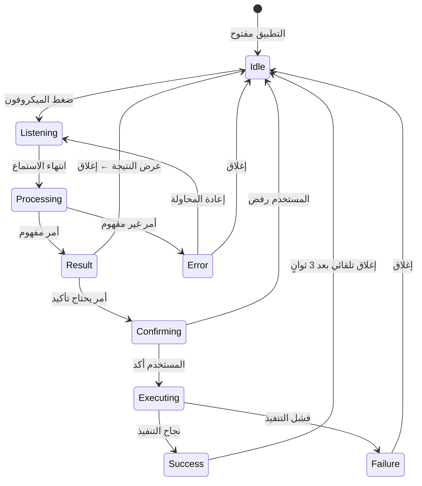

# 🎨 تصميم واجهة المساعد الصوتي — UI/UX Design

## 1. نظرة عامة على تجربة المستخدم

التصميم يتبع ثلاثة مبادئ:
1. **بساطة التفعيل** — ضغطة واحدة لبدء المساعد
2. **ردود فعل فورية** — المستخدم يرى ويسمع كل شيء
3. **تصميم عالمي** — بدون شاشات جديدة، كل شيء في Bottom Sheet

---

## 2. المكونات البصرية

### 2.1 زر الميكروفون العائم (VoiceFAB)

**الموقع:** أسفل يسار الشاشة، فوق شريط التنقل السفلي  
**الشكل:** دائرة متوهجة مع تأثير نبض خفيف لجذب الانتباه

```
┌──────────────────────────────┐
│                              │
│         [الشاشة الحالية]     │
│                              │
│                              │
│                              │
│                     🎤       │  ← VoiceFAB (ثابت دائماً)
│                              │
│  ┌──────────────────────┐    │
│  │ ⚙️  🏠  🌐  💰       │    │  ← شريط التنقل
│  └──────────────────────┘    │
└──────────────────────────────┘
```

#### التصميم التفصيلي:
```dart
// الحالة العادية
Container(
  width: 56, height: 56,
  decoration: BoxDecoration(
    shape: BoxShape.circle,
    gradient: LinearGradient(
      colors: [Color(0xFF6B48FF), Color(0xFF4A90E2)], // بنفسجي → أزرق
    ),
    boxShadow: [
      BoxShadow(
        color: Color(0xFF6B48FF).withOpacity(0.4),
        blurRadius: 20,
        spreadRadius: 2,
      ),
    ],
  ),
  child: Icon(Iconsax.microphone_2, color: Colors.white, size: 28),
)

// حالة الاستماع (Pulsing Animation)
AnimatedContainer(
  // نبض تكبير/تصغير + توهج متزايد
  transform: Matrix4.identity()..scale(isListening ? 1.15 : 1.0),
  decoration: BoxDecoration(
    gradient: LinearGradient(
      colors: [Color(0xFFFF6B6B), Color(0xFFFF8E53)], // أحمر → برتقالي
    ),
    boxShadow: [
      BoxShadow(
        color: Color(0xFFFF6B6B).withOpacity(isListening ? 0.6 : 0.3),
        blurRadius: isListening ? 35 : 20,
      ),
    ],
  ),
)
```

---

### 2.2 شيت المساعد الصوتي (VoiceAssistantBottomSheet)

يظهر من الأسفل عند الضغط على الميكروفون:

```
┌──────────────────────────────────┐
│          ─────────── (المقبض)     │
│                                  │
│  ┌────────────────────────────┐  │
│  │  🎤  "اسمع... تكلم الآن"   │  │  ← الحالة: استماع
│  │                            │  │
│  │  ~~~〰️〰️〰️〰️~~~           │  │  ← تأثير الموجة الصوتية
│  │                            │  │    (Waveform animation)
│  └────────────────────────────┘  │
│                                  │
│  💡 جرّب: "كم جهاز متصل؟"      │  ← اقتراح عشوائي
│         "أعد تشغيل المودم"      │
│         "كم الرصيد؟"            │
│                                  │
└──────────────────────────────────┘
```

#### بعد التعرف على الكلام:
```
┌──────────────────────────────────┐
│          ─────────── (المقبض)     │
│                                  │
│  ┌────────────────────────────┐  │
│  │  🗣️  "كم جهاز متصل"       │  │  ← النص المتعرف عليه
│  │                            │  │
│  │  ✅  "يوجد 5 أجهزة متصلة"  │  │  ← الاستجابة
│  │                            │  │
│  │  ┌──────────────────────┐  │  │
│  │  │ 📱 هاتف أحمد         │  │  │  ← نتيجة غنية (Rich)
│  │  │ 💻 لابتوب محمد       │  │  │
│  │  │ 📱 آيباد سارة        │  │  │
│  │  │ 💻 Unknown-A3F2      │  │  │
│  │  │ 📱 Galaxy S24        │  │  │
│  │  └──────────────────────┘  │  │
│  └────────────────────────────┘  │
│                                  │
│  🎤 أمر جديد    ✕ إغلاق        │
│                                  │
└──────────────────────────────────┘
```

#### عند طلب التأكيد (أمر خطير):
```
┌──────────────────────────────────┐
│          ─────────── (المقبض)     │
│                                  │
│  ┌────────────────────────────┐  │
│  │  🗣️  "احظر جهاز أحمد"     │  │
│  │                            │  │
│  │  ⚠️  هل أنت متأكد من      │  │  ← تأكيد مع تحذير
│  │     حظر "هاتف أحمد"؟      │  │
│  │                            │  │
│  │  ┌────────┐  ┌──────────┐  │  │
│  │  │ ❌ لا  │  │ ✅ نعم   │  │  │  ← أزرار + أمر صوتي
│  │  └────────┘  └──────────┘  │  │
│  │                            │  │
│  │  💬 أو قل "نعم" / "لا"    │  │
│  └────────────────────────────┘  │
│                                  │
└──────────────────────────────────┘
```

---

### 2.3 تأثير الموجة الصوتية (Voice Waveform)

تأثير بصري ديناميكي يتغير مع صوت المستخدم:

```dart
class VoiceWaveform extends StatelessWidget {
  final bool isListening;
  final double soundLevel; // 0.0 - 1.0

  @override
  Widget build(BuildContext context) {
    return CustomPaint(
      painter: WaveformPainter(
        isActive: isListening,
        amplitude: soundLevel,
        color: const Color(0xFF6B48FF),
      ),
      size: const Size(double.infinity, 60),
    );
  }
}
```

#### تفاصيل الـ Painter:
- **5 أشرطة عمودية** متحركة بأطوال مختلفة
- **ألوان متدرجة** (بنفسجي → أزرق) مع شفافية
- **استجابة لمستوى الصوت** — كلما ارتفع الصوت، زاد ارتفاع الأشرطة
- **Curve: Curves.easeInOut** للحركة السلسة

---

### 2.4 بطاقة النتيجة الغنية (VoiceResultCard)

حسب نوع الأمر، نعرض نتيجة مناسبة:

| نوع الأمر | العرض |
|---|---|
| عدد الأجهزة | رقم كبير متحرك (Animated Counter) |
| قائمة الأجهزة | ListView مصغر مع أيقونات |
| نسبة البطارية | شريط تقدم دائري |
| الإشارة | أشرطة إشارة ملونة |
| نجاح/فشل | أيقونة ✅/❌ كبيرة مع نص |
| الرصيد | بطاقة معلومات مختصرة |

---

## 3. الحالات البصرية (Visual States)

### 3.1 مخطط الحالات



### 3.2 الألوان حسب الحالة

| الحالة | لون الـ FAB | لون الخلفية | صوت |
|---|---|---|---|
| Idle | بنفسجي → أزرق | — | — |
| Listening | أحمر → برتقالي (نبض) | شفاف مع blur | صوت بدء |
| Processing | أبيض (دوران) | — | — |
| Success | أخضر | أخضر فاتح | صوت نجاح |
| Failure | أحمر | أحمر فاتح | صوت خطأ |
| Confirming | برتقالي | أصفر فاتح | صوت تنبيه |

---

## 4. الانيميشنات الرئيسية

### 4.1 ظهور الشيت
```dart
showModalBottomSheet(
  isScrollControlled: true,
  backgroundColor: Colors.transparent,
  transitionAnimationController: AnimationController(
    duration: const Duration(milliseconds: 400),
    vsync: this,
  ),
  builder: (context) => VoiceAssistantBottomSheet(),
);
```

### 4.2 تأثير النبض (Pulse Effect)
```dart
// تأثير pulse مستمر أثناء الاستماع
late final AnimationController _pulseController = AnimationController(
  vsync: this,
  duration: const Duration(milliseconds: 1500),
)..repeat(reverse: true);

late final Animation<double> _pulseAnimation = Tween<double>(
  begin: 1.0,
  end: 1.2,
).animate(CurvedAnimation(
  parent: _pulseController,
  curve: Curves.easeInOut,
));
```

### 4.3 تأثير الانتقال بين الحالات
```dart
AnimatedSwitcher(
  duration: const Duration(milliseconds: 300),
  transitionBuilder: (child, animation) => FadeTransition(
    opacity: animation,
    child: SlideTransition(
      position: Tween<Offset>(
        begin: const Offset(0, 0.1),
        end: Offset.zero,
      ).animate(animation),
      child: child,
    ),
  ),
  child: _buildCurrentState(), // يتغير حسب الحالة
);
```

---

## 5. ردود الفعل المتعددة الحواس (Multi-Sensory Feedback)

| الحدث | بصري | صوتي | لمسي (Haptic) |
|---|---|---|---|
| بدء الاستماع | FAB يتحول للأحمر + نبض | صوت بدء خفيف | `HapticFeedback.lightImpact()` |
| نهاية الاستماع | FAB يتوقف + دوران | صوت انتهاء | `HapticFeedback.mediumImpact()` |
| أمر مفهوم | بطاقة نتيجة + ✅ | TTS يقرأ | — |
| أمر غير مفهوم | رسالة خطأ ❌ | "لم أفهم" | `HapticFeedback.heavyImpact()` |
| تأكيد مطلوب | شيت تحذير ⚠️ | "هل أنت متأكد؟" | `HapticFeedback.selectionClick()` |
| نجاح التنفيذ | ✅ أخضر | "تم بنجاح" | `HapticFeedback.lightImpact()` |

---

## 6. اقتراحات الأوامر (Smart Suggestions)

### الاقتراحات السياقية
- في **لوحة التحكم**: "كم الإشارة؟" / "كم البطارية؟"
- في **الأجهزة المتصلة**: "احظر جهاز..." / "كم جهاز متصل؟"
- في **الإعدادات**: "غيّر باسورد الواي فاي" / "أعد تشغيل المودم"
- في **الرصيد**: "كم الرصيد؟" / "كم باقي من الباقة؟"

### عرض الاقتراحات
```dart
Wrap(
  spacing: 8,
  children: suggestions.map((s) => ActionChip(
    label: Text(s),
    avatar: const Icon(Iconsax.microphone_2, size: 16),
    onPressed: () => controller.executeTextCommand(s),
    // تنفيذ الأمر مباشرة بدون صوت (Text fallback)
  )).toList(),
)
```

---

## 7. التكامل مع MainLayoutPage

```dart
// في MainLayoutPage.build()
Stack(
  children: [
    // الشاشات الحالية
    IndexedStack(index: controller.currentIndex.value, children: pages),
    
    // ✨ الزر العائم الجديد
    Positioned(
      bottom: 110,
      right: 16,
      child: VoiceFAB(),
    ),
    
    // البار السفلي الحالي
    Positioned(
      bottom: 25, left: 20, right: 20,
      child: _buildDynamicBottomBar(),
    ),
  ],
);
```

---

## 8. تصميم Dark/Light Mode

كل المكونات تدعم الوضعين تلقائياً:

| العنصر | Dark Mode | Light Mode |
|---|---|---|
| خلفية الشيت | `Color(0xFF16213E).withOpacity(0.95)` | `Colors.white.withOpacity(0.95)` |
| نص الأمر | `Colors.white` | `Color(0xFF2C2C2C)` |
| نص الاستجابة | `Color(0xFF50E3C2)` (أخضر فاتح) | `Color(0xFF28C76F)` (أخضر) |
| الخلفية الزجاجية | blur 15 + dark overlay | blur 10 + white overlay |
| اقتراحات | chips with dark bg | chips with light bg |
