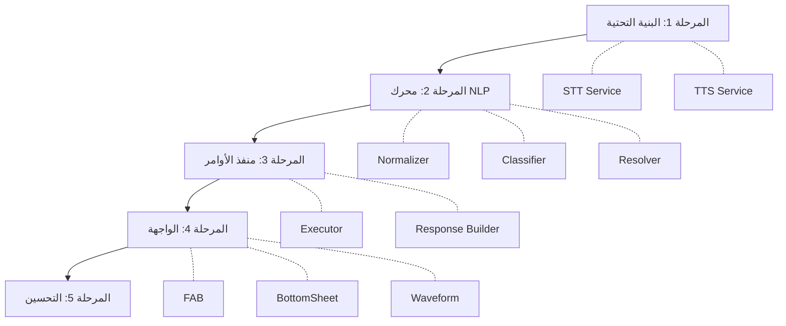

# 📅 مراحل التنفيذ — Implementation Phases

## نظرة عامة

التنفيذ مقسم إلى **5 مراحل** تدريجية، كل مرحلة تُنتج ميزة قابلة للاختبار:

```
المرحلة 1 (البنية التحتية) → المرحلة 2 (المحرك) → المرحلة 3 (المنفذ) → المرحلة 4 (الواجهة) → المرحلة 5 (التحسين)
```

---

## المرحلة 1: البنية التحتية الصوتية 🏗️

### الهدف
تجهيز خدمات STT و TTS والتأكد من عملها مع العربية.

### المهام

| # | المهمة | الملف | الأولوية |
|---|---|---|---|
| 1.1 | إضافة `speech_to_text` و `flutter_tts` للـ pubspec | `pubspec.yaml` | 🔴 |
| 1.2 | إضافة إذن `RECORD_AUDIO` للـ AndroidManifest | `AndroidManifest.xml` | 🔴 |
| 1.3 | إضافة أذونات iOS (Info.plist) | `Info.plist` | 🔴 |
| 1.4 | بناء `SpeechRecognitionService` | `infrastructure/services/speech_recognition_service.dart` | 🔴 |
| 1.5 | بناء `TtsService` | `infrastructure/services/tts_service.dart` | 🔴 |
| 1.6 | بناء `VoiceFeedbackService` | `infrastructure/services/voice_feedback_service.dart` | 🟡 |
| 1.7 | اختبار STT مع locale عربي | — | 🔴 |

### الملفات الجديدة
```
lib/features/voice_assistant/
├── infrastructure/
│   └── services/
│       ├── speech_recognition_service.dart
│       ├── tts_service.dart
│       └── voice_feedback_service.dart
```

### معايير الإنجاز
- [x] المايك يعمل ويتعرف على الكلام العربي
- [x] التطبيق ينطق جملة عربية بنجاح
- [x] الأذونات مُعدة لـ Android و iOS

---

## المرحلة 2: محرك فهم اللغة 🧠

### الهدف
بناء NLP Engine الذي يحوّل النص العربي إلى أوامر مُهيكلة.

### المهام

| # | المهمة | الملف | الأولوية |
|---|---|---|---|
| 2.1 | بناء `ArabicNormalizer` | `domain/services/arabic_normalizer.dart` | 🔴 |
| 2.2 | بناء `EntityExtractor` | `domain/services/entity_extractor.dart` | 🔴 |
| 2.3 | بناء `DialectSynonyms` | `domain/services/dialect_synonyms.dart` | 🔴 |
| 2.4 | تعريف الـ Enums والـ Entities | `domain/entities/` + `domain/enums/` | 🔴 |
| 2.5 | بناء `CommandRegistry` (سجل الأوامر) | `domain/services/command_registry.dart` | 🔴 |
| 2.6 | بناء `IntentClassifier` | `domain/services/intent_classifier.dart` | 🔴 |
| 2.7 | بناء `CommandResolver` | `domain/services/command_resolver.dart` | 🔴 |
| 2.8 | بناء `VoiceCommandInterpreter` (المنسق) | `domain/services/voice_command_interpreter.dart` | 🔴 |
| 2.9 | اختبار المحرك مع حالات متنوعة | Unit Tests | 🟡 |

### الملفات الجديدة
```
lib/features/voice_assistant/
├── domain/
│   ├── entities/
│   │   ├── voice_command.dart
│   │   ├── voice_intent.dart
│   │   └── voice_response.dart
│   ├── enums/
│   │   ├── voice_intent_type.dart
│   │   └── command_category.dart
│   └── services/
│       ├── arabic_normalizer.dart
│       ├── entity_extractor.dart
│       ├── dialect_synonyms.dart
│       ├── command_registry.dart
│       ├── intent_classifier.dart
│       ├── command_resolver.dart
│       └── voice_command_interpreter.dart
```

### معايير الإنجاز
- [x] "كم جهاز متصل" → `query.devices.count`
- [x] "احظر جهاز أحمد" → `action.security.block` + `{mac: "..."}`
- [x] "أعد تشغيل المودم" → `action.system.reboot`
- [x] "ريستارت" → `action.system.reboot` (لهجة)
- [x] المحرك يتعامل مع 25+ أمر بنجاح

---

## المرحلة 3: منفذ الأوامر ⚡

### الهدف
ربط المحرك بالـ Controllers الحالية لتنفيذ الأوامر فعلياً.

### المهام

| # | المهمة | الملف | الأولوية |
|---|---|---|---|
| 3.1 | بناء `VoiceCommandExecutor` | `domain/services/voice_command_executor.dart` | 🔴 |
| 3.2 | تنفيذ أوامر الاستعلام (Query) | — | 🔴 |
| 3.3 | تنفيذ أوامر الإجراء (Action) | — | 🔴 |
| 3.4 | تنفيذ أوامر التنقل (Navigate) | — | 🟡 |
| 3.5 | بناء آلية التأكيد | — | 🔴 |
| 3.6 | بناء ResponseBuilder (بناء الاستجابات) | `domain/services/response_builder.dart` | 🔴 |

### الملفات الجديدة
```
lib/features/voice_assistant/
├── domain/
│   └── services/
│       ├── voice_command_executor.dart
│       └── response_builder.dart
```

### حالات الـ Executor مع كل Controller

```dart
// مثال: الربط مع ConnectedDevicesController
case 'query.devices.count':
  final controller = Get.find<ConnectedDevicesController>();
  await controller.fetchDevices();
  final count = controller.devices.length;
  return VoiceResponse(
    success: true,
    spokenText: 'يوجد $count جهاز متصل حالياً',
    displayText: '$count جهاز متصل',
  );

// مثال: الربط مع AuthController
case 'action.system.reboot':
  // هذا الأمر يتطلب تأكيد — المنفذ لا ينفذ مباشرة
  return VoiceResponse.confirmationRequired(
    message: 'سيتم إعادة تشغيل المودم وسينقطع الإنترنت مؤقتاً. هل أنت متأكد؟',
    onConfirm: () async {
      final auth = Get.find<AuthController>();
      // تنفيذ الأمر بدون حوار التأكيد العادي (لأن التأكيد الصوتي كافٍ)
      final sessionId = await SessionManager.getSessionId();
      if (sessionId != null) {
        await auth.rebootUseCase.execute(sessionId);
      }
    },
  );
```

### معايير الإنجاز
- [x] كل أمر من الـ 25 ينفذ بنجاح
- [x] الأوامر الخطيرة تطلب تأكيد
- [x] الاستجابات مناسبة ومفيدة

---

## المرحلة 4: الواجهة والتفاعل 🎨

### الهدف
بناء واجهة المساعد الصوتي الاحترافية.

### المهام

| # | المهمة | الملف | الأولوية |
|---|---|---|---|
| 4.1 | بناء `VoiceFAB` (الزر العائم) | `presentation/widgets/voice_fab.dart` | 🔴 |
| 4.2 | بناء `VoiceAssistantBottomSheet` | `presentation/widgets/voice_bottom_sheet.dart` | 🔴 |
| 4.3 | بناء `VoiceWaveform` (تأثير الموجة) | `presentation/widgets/voice_waveform.dart` | 🟡 |
| 4.4 | بناء `VoiceResultCard` (بطاقة النتيجة) | `presentation/widgets/voice_result_card.dart` | 🔴 |
| 4.5 | بناء `VoiceCommandChip` (اقتراحات) | `presentation/widgets/voice_command_chip.dart` | 🟢 |
| 4.6 | بناء `VoiceAssistantController` | `presentation/controllers/voice_assistant_controller.dart` | 🔴 |
| 4.7 | التكامل مع `MainLayoutPage` | `main_layout_page.dart` (تعديل) | 🔴 |
| 4.8 | دعم Dark/Light mode | — | 🟡 |
| 4.9 | إضافة الانيميشنات | — | 🟡 |

### الملفات الجديدة
```
lib/features/voice_assistant/
├── presentation/
│   ├── controllers/
│   │   └── voice_assistant_controller.dart
│   └── widgets/
│       ├── voice_fab.dart
│       ├── voice_bottom_sheet.dart
│       ├── voice_waveform.dart
│       ├── voice_result_card.dart
│       └── voice_command_chip.dart
```

### الملفات المعدلة
```
lib/features/main_layout/presentation/pages/main_layout_page.dart  (إضافة VoiceFAB)
lib/core/di/injection_container.dart                                (إضافة DI)
android/app/src/main/AndroidManifest.xml                           (إضافة إذن)
pubspec.yaml                                                       (إضافة حزم)
```

### معايير الإنجاز
- [x] الزر يظهر في كل الشاشات
- [x] الشيت يفتح/يغلق بسلاسة
- [x] الموجة الصوتية تعمل
- [x] النتائج تُعرض بشكل غني
- [x] يدعم الوضع الليلي والنهاري

---

## المرحلة 5: التحسين والاحتراف ✨

### الهدف
تحسين الدقة، تجربة المستخدم، والتعامل مع الحالات الحافة.

### المهام

| # | المهمة | الأولوية |
|---|---|---|
| 5.1 | اقتراحات سياقية حسب الشاشة الحالية | 🟡 |
| 5.2 | محادثة متعددة الجولات (Multi-turn Dialog) | 🟡 |
| 5.3 | دعم الأمر النصي (Fallback Text Input) | 🟡 |
| 5.4 | صفحة محفوظات الأوامر | 🟢 |
| 5.5 | تحسين القاموس اللهجوي | 🟡 |
| 5.6 | إضافة أصوات تأثيرية | 🟢 |
| 5.7 | Onboarding تعليمي للمساعد الصوتي | 🟢 |
| 5.8 | مؤشر VoiceFAB يعرض آخر أمر بنجاح (tooltip) | 🟢 |
| 5.9 | تحسين الأداء وتقليل الذاكرة | 🟡 |

---

## ملخص الملفات

### ملفات جديدة (17 ملف)
```
lib/features/voice_assistant/
├── domain/
│   ├── entities/
│   │   ├── voice_command.dart
│   │   ├── voice_intent.dart
│   │   └── voice_response.dart
│   ├── enums/
│   │   ├── voice_intent_type.dart
│   │   └── command_category.dart
│   └── services/
│       ├── arabic_normalizer.dart
│       ├── entity_extractor.dart
│       ├── dialect_synonyms.dart
│       ├── command_registry.dart
│       ├── intent_classifier.dart
│       ├── command_resolver.dart
│       ├── voice_command_interpreter.dart
│       ├── voice_command_executor.dart
│       └── response_builder.dart
├── infrastructure/
│   └── services/
│       ├── speech_recognition_service.dart
│       ├── tts_service.dart
│       └── voice_feedback_service.dart
└── presentation/
    ├── controllers/
    │   └── voice_assistant_controller.dart
    └── widgets/
        ├── voice_fab.dart
        ├── voice_bottom_sheet.dart
        ├── voice_waveform.dart
        ├── voice_result_card.dart
        └── voice_command_chip.dart
```

### ملفات معدلة (4 ملفات)
```
pubspec.yaml                    → إضافة speech_to_text + flutter_tts
AndroidManifest.xml             → إضافة RECORD_AUDIO permission
injection_container.dart        → إضافة DI للمساعد الصوتي
main_layout_page.dart           → إضافة VoiceFAB في Stack
```

---

## ترتيب التبعيات


